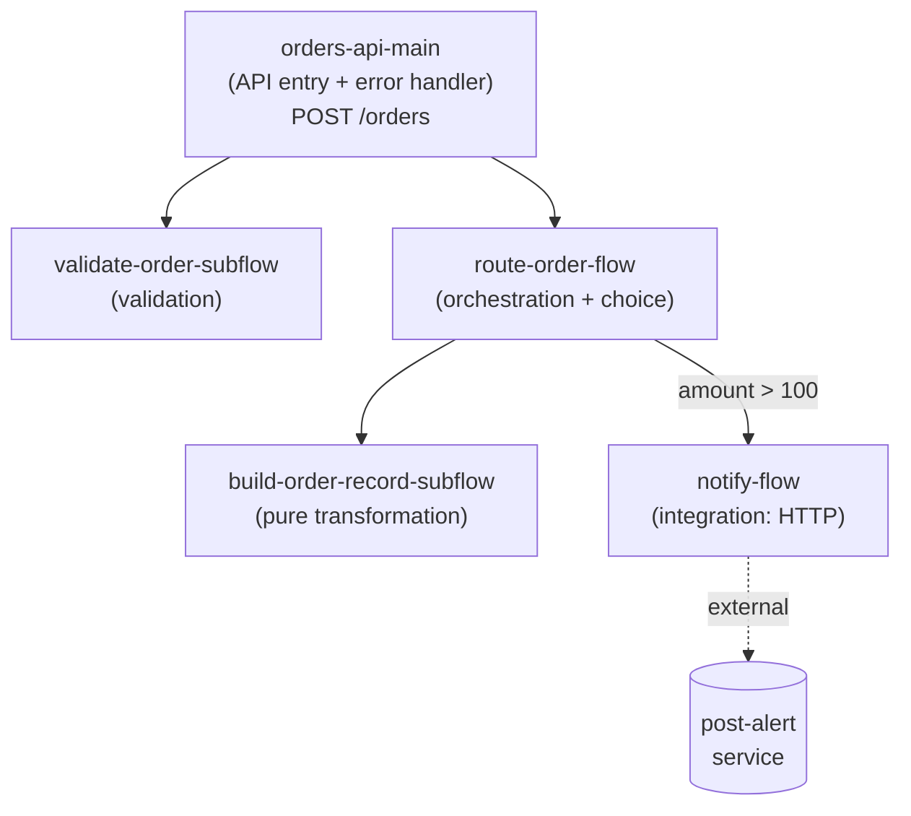

# MUnit Methodology — Step-by-Step Walkthrough

> **Author:** Gonzalo Marcos · **Version:** 1.0 · **Date:** 2026-06-24 · **Status:** not validated · **Lang:** en

A teaching companion to the [MUnit Testing Standard](./MUNIT-TESTING-STANDARD.md). It takes **one
small but realistic application** — `orders-api` — and runs it through all **8 methodology steps**,
showing the artifact each step produces, until we arrive at finished suites and a catalog entry.

Use this to onboard the team: read the standard for the *rules*, read this for the *moves*.

---

## Table of Contents

- [0. The example app](#0-the-example-app)
- [Step 1 — Inventory units](#step-1--inventory-units)
- [Step 2 — Map the contract & boundaries](#step-2--map-the-contract--boundaries)
- [Step 3 — Derive test cases](#step-3--derive-test-cases)
- [Step 4 — Decide the mock/stub plan](#step-4--decide-the-mockstub-plan)
- [Step 5 — Select the MUnit construct](#step-5--select-the-munit-construct)
- [Step 6 — Define assertions & verifications](#step-6--define-assertions--verifications)
- [Step 7 — Apply the standards](#step-7--apply-the-standards)
- [Step 8 — Set & enforce coverage](#step-8--set--enforce-coverage)
- [The end state](#the-end-state)
- [How to present this to the team](#how-to-present-this-to-the-team)

---

## 0. The example app

`orders-api` accepts an order over HTTP, validates it, builds a record, accepts it, and — **only
for orders over 100** — fires a notification to an external service. It is deliberately small but
contains **five units spanning five archetypes**, so every part of the methodology has something to
bite on.



Simplified production XML (`src/main/mule/orders.xml`) — enough to derive tests from:

```xml
<!-- API entry: receives the request, orchestrates, maps errors to status codes -->
<flow name="orders-api-main">
    <http:listener config-ref="orders-http" path="/orders"/>
    <flow-ref name="validate-order-subflow"/>
    <flow-ref name="route-order-flow"/>
    <ee:transform>  <!-- 201 body --> </ee:transform>
    <error-handler>
        <on-error-propagate type="ORDERS:INVALID">
            <ee:transform>  <!-- HTTP 400 body --> </ee:transform>
            <set-variable variableName="httpStatus" value="400"/>
        </on-error-propagate>
        <on-error-continue type="HTTP:CONNECTIVITY">
            <!-- notification failed: accept the order anyway, mark notified=false -->
            <set-payload value='#[payload ++ { notified: false }]'/>
        </on-error-continue>
    </error-handler>
</flow>

<!-- Validation: raises ORDERS:INVALID when the order is not usable -->
<sub-flow name="validate-order-subflow">
    <choice>
        <when expression="#[payload.amount == null or payload.amount &lt;= 0]">
            <raise-error type="ORDERS:INVALID" description="amount must be a positive number"/>
        </when>
    </choice>
</sub-flow>

<!-- Pure transformation: shape the inbound order into the stored record -->
<sub-flow name="build-order-record-subflow">
    <ee:transform>
        <ee:message><ee:set-payload><![CDATA[%dw 2.0
output application/json
---
{
  orderId: uuid(),
  amount:  payload.amount,
  tier:    if (payload.amount > 100) "priority" else "standard"
}]]></ee:set-payload></ee:message>
    </ee:transform>
</sub-flow>

<!-- Orchestration + choice: build the record, notify only above threshold -->
<flow name="route-order-flow">
    <flow-ref name="build-order-record-subflow"/>
    <choice>
        <when expression="#[payload.amount > 100]">
            <flow-ref name="notify-flow"/>
            <set-payload value='#[payload ++ { status: "accepted", notified: true }]'/>
        </when>
        <otherwise>
            <set-payload value='#[payload ++ { status: "accepted", notified: false }]'/>
        </otherwise>
    </choice>
</flow>

<!-- Integration: one external HTTP call -->
<flow name="notify-flow">
    <http:request config-ref="alerts-http" method="POST" path="/post-alert" doc:name="post-alert"/>
</flow>
```

### The API spec

The app exposes one operation. A **minimal RAML 1.0** spec (`src/main/resources/api/orders.raml`)
is enough to drive the **Traceability** section of the Test Design Document — it pins the request
shape and the two responses the flow must produce:

```yaml
#%RAML 1.0
title: Orders API
version: v1
mediaType: application/json

types:
  OrderRequest:
    type: object
    additionalProperties: false
    properties:
      amount:
        type: number
        description: Order amount. Must be greater than 0.
        example: 250
  OrderAccepted:
    type: object
    properties:
      orderId: string
      amount:  number
      tier:
        type: string
        enum: [ standard, priority ]   # priority when amount > 100
      status:
        type: string
        enum: [ accepted ]
      notified: boolean                # false if the notification call failed
  Error:
    type: object
    properties:
      error:   string
      message: string

/orders:
  post:
    displayName: Create order
    body:
      application/json:
        type: OrderRequest
    responses:
      201:
        description: Order accepted. Notified when amount > 100; notified=false if the alert call fails.
        body:
          application/json:
            type: OrderAccepted
      400:
        description: Invalid order — amount missing or <= 0 (maps from ORDERS:INVALID).
        body:
          application/json:
            type: Error
```

📄 Save as: `src/main/resources/api/orders.raml`

> [!NOTE]
> This is the `apiSpec` you pass in Phase 1. Each spec'd behaviour below maps to a test — that is
> the Traceability section the agent produces:
>
> | Spec'd behaviour | Maps to test |
> | --- | --- |
> | `201` + notified when amount > 100 | `route-order-should-notify-when-amount-over-threshold` · `orders-api-should-return-201-on-valid-order` |
> | `201` + not notified when amount ≤ 100 | `route-order-should-not-notify-when-amount-under-threshold` |
> | `201` + `notified=false` when alert fails | `orders-api-should-accept-order-when-notification-fails` |
> | `400` when amount missing or ≤ 0 | `orders-api-should-return-400-on-invalid-order` · `validate-order-should-raise-invalid-*` |

> [!NOTE]
> We will spotlight `route-order-flow` in full depth (it is the richest unit) and summarize the
> others, so the walkthrough stays followable. The method is identical for every unit.

---

## Step 1 — Inventory units

**Deeper explanation.** The first discipline is refusing to test "the app". You test *units*, and a
unit is anything you can drive with a `<flow-ref>`: a `flow`, a `sub-flow`, or an `error-handler`.
Naming the unit forces you to name its **archetype**, and the archetype (Testing Standard §3) fixes
the *mandatory* tests before you've thought about a single edge case. This is what makes two
engineers produce the same test set.

> [!NOTE]
> **What is an archetype?** An archetype is the *category of a unit based on the role it plays in the
> app* — its structural pattern (the answer to "what kind of flow is this?"). It is **not** a Mule
> keyword or a MUnit feature; it is a classification this methodology defines. Its purpose is
> leverage: **once you know a unit's archetype, its mandatory tests are already decided** — before
> you consider a single edge case. The nine archetypes are catalogued in
> [Testing Standard §3](./MUNIT-TESTING-STANDARD.md#3-unit-archetype--mandatory-test-matrix), each
> mapped to its required test categories and typical mocks:
>
> | Archetype | What the unit does |
> | --- | --- |
> | **API entry flow** | HTTP listener that receives a request and orchestrates a response |
> | **Orchestration flow** | Calls several collaborators and composes a result |
> | **Transformation sub-flow** | Pure DataWeave shaping, no external calls |
> | **Integration / connector flow** | Wraps a single connector op (DB, SF, HTTP, MQ) |
> | **Choice / router flow** | Routes by a condition |
> | **Scatter-gather / parallel flow** | Fans out and aggregates |
> | **For-each / batch flow** | Iterates a collection |
> | **Scheduler-triggered flow** | Runs on a timer |
> | **Error handler / on-error scope** | Catches and maps/propagates errors |
>
> A unit can match **more than one** archetype (see `orders-api-main` below) — its mandatory tests
> are then the **union** of the matching rows.

**Example.** `route-order-flow` is classified as *orchestration + choice*. That label alone dictates
its tests: a happy path, **one test per branch** (over/under threshold), each collaborator-failure
path, and a `verify-call` on each downstream call — none of which you had to invent.

**Action.** List every flow/sub-flow/error handler and classify it.

**Artifact — unit inventory:**

| Unit | Archetype | Source |
| --- | --- | --- |
| `orders-api-main` | API entry **+** error handler | `orders.xml` |
| `validate-order-subflow` | validation (transformation) | `orders.xml` |
| `build-order-record-subflow` | pure transformation | `orders.xml` |
| `route-order-flow` | orchestration **+** choice | `orders.xml` |
| `notify-flow` | integration (HTTP) | `orders.xml` |

### Can one flow belong to more than one archetype?

**Yes — and it is common.** Archetypes describe *roles*, not mutually-exclusive types, so a flow
belongs to as many archetypes as the roles it actually performs. In our inventory two units already
do: `orders-api-main` is *API entry **+** error handler*, and `route-order-flow` is
*orchestration **+** choice*.

**The rule when a unit matches several: take the union of mandatory tests** — add the requirements
together, never drop a category because another archetype also applies. So `orders-api-main` must
have *both* entry-flow tests (happy path + each error→status mapping) *and* error-handler tests
(one per caught error type, correct mapping/propagation).

| Common combination | Why it occurs |
| --- | --- |
| API entry **+** error handler | almost every public flow maps errors to HTTP statuses |
| orchestration **+** choice | composing collaborators with conditional routing (`route-order-flow`) |
| integration **+** error handler | a connector call plus its connectivity-error handling |
| orchestration **+** scatter-gather | fan-out aggregation inside a larger composition |

> [!WARNING]
> **Watch the count as a design signal.** Matching two or three roles is normal. If one flow matches
> *many* archetypes (e.g. API entry + orchestration + choice + for-each + integration), the union of
> mandatory tests balloons — and that is a smell that the flow does too much. Decompose it into
> smaller sub-flows, each a cleaner single-archetype unit that is far easier to test in isolation.
> The methodology surfacing "this needs 12 mandatory tests" is itself useful refactoring feedback.

---

## Step 2 — Map the contract & boundaries

**Deeper explanation.** A unit's tests are a function of its **contract** (what goes in, what comes
out) and its **boundaries** (what it delegates to others). You cannot write a `set-event` without
knowing the inputs, and you cannot write a `mock-when` without knowing the collaborators. This step
is pure reading — no test decisions yet. Getting it complete here is what prevents "oops, I forgot
the error path" later.

**Action.** For each unit, fill a contract sheet: inputs, outputs, collaborators-to-mock, branches,
errors.

**Artifact — contract sheet for the spotlight unit `route-order-flow`:**

| Field | Value |
| --- | --- |
| **Inputs** | `payload.amount` (number) — already validated upstream |
| **Outputs** | `payload` + `{ status, notified, orderId, tier }` |
| **Collaborators (boundary)** | `build-order-record-subflow` (owned, in-memory) · `notify-flow` → `http:request post-alert` (**external**) |
| **Branches** | `choice`: `amount > 100` (notify) vs `otherwise` (don't notify) |
| **Errors** | `HTTP:CONNECTIVITY` may bubble up from `notify-flow` |

Contract sheets for the other units (summarized):

| Unit | Inputs | Output | Boundary to mock | Branches | Errors |
| --- | --- | --- | --- | --- | --- |
| `validate-order-subflow` | `payload.amount` | unchanged payload | none | amount valid / invalid | raises `ORDERS:INVALID` |
| `build-order-record-subflow` | `payload.amount` | `{orderId, amount, tier}` | none (uuid is in-memory) | tier priority/standard | none |
| `notify-flow` | `payload` | response | `http:request post-alert` | none | `HTTP:CONNECTIVITY` |
| `orders-api-main` | HTTP request body | 201 / 400 + body | the two sub-flows | error handler routes | catches `ORDERS:INVALID`, `HTTP:CONNECTIVITY` |

> [!IMPORTANT]
> Distinguish **owned** logic from **boundary** collaborators. `build-order-record-subflow` is
> *owned* by `route-order-flow`'s behaviour, so we leave it real. `notify-flow`'s HTTP call is a
> *boundary*, so we mock it. Mocking owned logic would test nothing.

### What is a "boundary collaborator"?

A **boundary collaborator** is anything the unit-under-test calls that lives on the *other side* of
its boundary — logic the unit **delegates to** rather than **owns**. It combines two terms from the
[Testing Standard glossary](./MUNIT-TESTING-STANDARD.md#12-glossary): a *collaborator* (anything the
SUT calls) that sits across the *boundary* (the line between owned logic and delegated work). These
are exactly the calls you **mock**.

In Step 2 you sort every call a unit makes into one of two buckets:

| | **Boundary collaborator** | **Owned logic** |
| --- | --- | --- |
| What it is | external dependency the unit delegates to | in-memory logic the unit is responsible for |
| Examples | `http:request`, DB select, Salesforce query, MQ publish, a sub-flow that reaches out | DataWeave transforms, `choice` routing, variable manipulation, a pure helper sub-flow |
| In a unit test | **mock it** (mock-return / mock-error) | **leave it real** |

Why the line matters: mocking owned logic tests nothing (you'd assert your own mock), and *not*
mocking a boundary collaborator breaks the isolation principle — the test would hit a real
network/DB and become slow, flaky, and non-deterministic.

In our spotlight unit, `route-order-flow`'s two calls fall on opposite sides:
`build-order-record-subflow` is **owned** (pure DataWeave it depends on → leave real), while
`notify-flow` → `http:request post-alert` is a **boundary collaborator** (external HTTP → mock + verify).

> [!NOTE]
> "Boundary" is **relative to the unit under test**. `build-order-record-subflow` is *owned* from
> `route-order-flow`'s perspective — but when it is itself the SUT, it becomes its own unit with its
> own (here, none) boundary collaborators.

### Which errors go in the contract of an HTTP flow?

A common question on HTTP/API entry flows: do we list **every** status the API can return
(400, 401, 403, …, 500), or only the errors handled at this flow? **Scope the contract to the
errors this unit *owns*** — not the whole status catalog. Classify by origin:

| Error origin | In *this* flow's contract? | Tested where |
| --- | --- | --- |
| Errors the flow **raises itself** (e.g. `raise-error ORDERS:INVALID`) | ✅ yes | this flow's suite — assert the error *type* is raised |
| Errors a collaborator throws that **this flow's own flow-level handler** catches/maps | ✅ yes | this flow's suite — mock-error + assert the local mapping |
| Errors that **propagate up to a global/shared error handler** | ❌ no — only note "propagates `TYPE`" | the **global handler's own suite** |

Two reasons this is the rule:

1. **The global error handler is its own unit** (`error-handler` archetype). Test it **once**, in
   one suite, with one test per mapping (`APIKIT:BAD_REQUEST → 400`, `APIKIT:NOT_FOUND → 404`,
   `ANY → 500`, …). Re-testing those in every flow that could trigger them is the duplication the
   isolation principle exists to prevent.
2. **At the unit level you assert the error *type*, not the HTTP status.** When you drive a flow with
   `<flow-ref>`, the status code is applied by the global handler's error-response config, which is
   outside that execution — so the contract records *"propagates `HTTP:CONNECTIVITY`"* and the test
   uses `expectedErrorType`. The `TYPE → status/body` mapping is verified in the handler's suite.

> [!WARNING]
> **401 / 403 are usually not your flow logic at all.** They are applied by API Manager policies or
> the Flex Gateway *before* the request reaches your flow. No flow or error handler in the app owns
> them, so they are **not MUnit-unit-testable** — they belong to policy/integration testing, which
> is out of scope (Testing Standard §1.4).

Applied to our app: `orders-api-main` lists only what it owns — its flow-level handler mapping
`ORDERS:INVALID → 400` and handling `HTTP:CONNECTIVITY` (accept-anyway). Were it APIkit-based, the
`404 / 405 / 415 / 500` router mappings would live in a **separate global-handler suite**, not here.

---

## Step 3 — Derive test cases

**Deeper explanation.** Now we turn the contract sheet into a list of tests — **mechanically**, not
by intuition. Two rule sets combine:

1. **Mandatory categories** from the archetype (Testing Standard §3) — the floor.
2. **Taxonomy triggers** (Testing Standard §4) — described in detail below.

A *trigger* is a question you ask of the contract sheet. Each time the answer is "yes, here," it
**fires** — and one firing produces one test. You are not deciding *whether* to write a test; you
are scanning the contract for things that match a trigger and transcribing what you find. That is
what makes the list reproducible: two engineers reading the same contract fire the same triggers.

#### The seven triggers, in detail

| Trigger | The question you ask the contract | What you read it from | Fires on `route-order-flow` |
| --- | --- | --- | --- |
| **Happy path** | "What is the normal successful outcome?" | the **Outputs** field | order accepted, `notified=true` (amount 250) → test #1 |
| **Branch** | "Where does control split — `choice`/`when`/`otherwise`, scatter-gather, for-each?" | the **Branches** field | one test per route: `>100` and `otherwise` → tests #1 & #2 |
| **Input variant** | "Which input fields have distinct *equivalence classes* — meaningfully different value groups?" | the **Inputs** field | amount partitions: above vs at-or-below threshold (covered by the branch tests here) |
| **Boundary value** | "For each input with a limit (a `>`, `>=`, length, range, optionality), what are the values *right at the edge*?" | the **Inputs** + the branch conditions | amount **exactly 100** — the edge of `> 100` → test #3 |
| **Error path** | "Which error types does the unit raise, or catch from a collaborator?" | the **Errors** field | `HTTP:CONNECTIVITY` from `notify-flow` → test #4 |
| **Behavioural** | "Which collaborator *must* be called — and how many times — for the outcome to be correct?" | the **Collaborators** field | `post-alert` must be called **once** above threshold (a `verify-call`, added in Step 5/6) |
| **Negative** | "Where is the correct behaviour *to do nothing* — no call, no change?" | branches + collaborators | at/under threshold `post-alert` must **not** be called (`verify ×0`) → tests #2 & #3 |

> [!IMPORTANT]
> **How the triggers interact.** A single test usually satisfies several triggers at once — test #1
> is *happy path* **and** the `>100` *branch* **and** a *behavioural* `verify ×1`. You do not write
> three tests for that; you write **one** test that carries all three concerns about that one path.
> The triggers are a checklist to make sure no concern is *missed*, not a multiplier that inflates
> the count. Conversely, when two triggers describe genuinely different inputs/outcomes (amount 250
> vs amount 100), they are **different tests** — that is the boundary-value trigger earning its keep.

#### Finding the input-variant & boundary triggers: partitions (summary)

The *input-variant*, *boundary*, *negative*, and *error* triggers all come from one technique —
splitting each input into **partitions** (equivalence classes):

- A **partition** is a set of input values the unit treats **identically** — same path, same
  outcome. Because they are equivalent, **one representative value tests the whole class**.
- You find partitions by reading each input's rules (validations, `choice` conditions): each rule
  carves the input into **valid** classes (→ happy/input-variant tests) and **invalid** classes
  (→ negative/error tests). For `amount`: `>100`, `1–100`, `≤0`, and `null/missing`.
- A `choice` condition *is* a partition boundary — so branch coverage and partition coverage are the
  same analysis from two angles.
- **Boundary-value analysis** then adds the value **on each dividing line** (exactly `100`, the
  `>` vs `>=` suspect) — off-by-one bugs live there and survive equivalence testing alone.

> [!NOTE]
> This is the most leveraged technique in Step 3 and has its own deep dive — definition, the
> partitions→triggers mapping, the find-them procedure, and worked examples for numeric thresholds,
> string formats, enum routing, optional fields, collections, and multi-field combinations:
> **[Input Partitioning guide](./MUNIT-INPUT-PARTITIONING.md)**.

Walking these against the contract sheet *generates* the list; you are not inventing it.

**Artifact — derivation for `route-order-flow`:**

| # | Trigger that fired | Test ID |
| --- | --- | --- |
| 1 | happy path + branch `>100` | `route-order-should-notify-when-amount-over-threshold` |
| 2 | negative + branch `≤100` | `route-order-should-not-notify-when-amount-under-threshold` |
| 3 | boundary value (exactly 100 → otherwise) | `route-order-should-not-notify-when-amount-equals-threshold` |
| 4 | error path (`notify-flow` fails) | `route-order-should-propagate-connectivity-error` |

**Artifact — derived cases for the whole app (summary):**

| Unit | Derived tests |
| --- | --- |
| `validate-order-subflow` | `should-pass-when-amount-positive` · `should-raise-invalid-when-amount-zero` · `should-raise-invalid-when-amount-missing` |
| `build-order-record-subflow` | `should-set-priority-tier-over-100` · `should-set-standard-tier-100-or-below` · `should-copy-amount-through` |
| `notify-flow` | `should-post-alert-once` · `should-propagate-connectivity-error` |
| `orders-api-main` | `should-return-201-on-valid-order` · `should-return-400-on-invalid-order` · `should-accept-order-when-notification-fails` |

> [!TIP]
> Notice the **boundary value at exactly 100** (test #3). Boundary-value analysis is the rule that
> catches off-by-one bugs in the `>` vs `>=` condition — the kind a "happy + sad" approach misses.

---

## Step 4 — Decide the mock/stub plan

**Deeper explanation.** For each test, every boundary collaborator needs a decision:
**mock-return** (canned success), **mock-error** (canned failure), **spy** (inspect mid-flow), or
**leave-real** (owned in-memory logic). The decision table in Testing Standard §4 makes this
deterministic. A test that touches a real collaborator is, by definition, not a unit test.

**Artifact — mock plan for `route-order-flow`'s four tests:**

| Test | `build-order-record-subflow` | `notify-flow` (`post-alert`) |
| --- | --- | --- |
| #1 notify over threshold | leave-real (owned) | **mock-return** 200 · **verify** ×1 |
| #2 not notify under threshold | leave-real | **mock-return** (defence) · **verify** ×0 |
| #3 not notify at threshold (100) | leave-real | **mock-return** (defence) · **verify** ×0 |
| #4 propagate connectivity error | leave-real | **mock-error** `HTTP:CONNECTIVITY` |

> [!WARNING]
> Test #2/#3 still **mock** `post-alert` even though it shouldn't be called — *defence in depth*.
> If the routing condition were broken and the call slipped through, the mock keeps the test offline
> and the `verify ×0` is what fails (loudly), not a real network call.

---

## Step 5 — Select the MUnit construct

**Deeper explanation.** Each test concern maps to exactly one MUnit construct via the
feature-selection matrix (Testing Standard §5). Choosing by *intent* — not habit — is what stops
people reaching for `assert-equals` when they needed `verify-call`, or hand-rolling five near-clones
when a parameterized suite was the right tool.

**Artifact — construct selection for `route-order-flow`:**

| Test | Inputs | Replace call | Assert state | Verify behaviour |
| --- | --- | --- | --- | --- |
| #1 | `set-event` amount 250 | `mock-when` post-alert → 200 | `assert-that` notified == true | `verify-call` post-alert ×1 |
| #2 | `set-event` amount 25 | `mock-when` post-alert | `assert-that` notified == false | `verify-call` post-alert ×0 |
| #3 | `set-event` amount 100 | `mock-when` post-alert | `assert-that` notified == false | `verify-call` post-alert ×0 |
| #4 | `set-event` amount 250 | `mock-when` post-alert → error | `assert` error type | — |

> [!TIP]
> Tests #1–#3 differ **only by data** (amount + expected). That is the §6 trigger to consider a
> **parameterized suite** — we apply it in Step 7.

---

## Step 6 — Define assertions & verifications

**Deeper explanation.** Two kinds of check, and the distinction matters:

- **State-based** (`assert-equals` / `assert-that` + Hamcrest) — "the *result* is correct".
- **Behaviour-based** (`verify-call`) — "the *right thing happened* on the way there".

Orchestration units need both: the output can look right while a downstream call was skipped or
duplicated. Keep **one logical concern per test** and lay each out **Given → When → Then**.

**Artifact — test #1 written out:**

```xml
<munit:test name="route-order-should-notify-when-amount-over-threshold"
            description="An order with amount greater than 100 is accepted, notified=true, and post-alert is called exactly once.">
    <!-- GIVEN: an order over the notification threshold -->
    <munit:behavior>
        <munit:set-event doc:name="Input: order amount 250">
            <munit:payload value='#[%dw 2.0 output application/json --- { amount: 250 }]'
                           mediaType="application/json"/>
        </munit:set-event>
        <munit-tools:mock-when processor="http:request" doc:name="Mock post-alert returns 200">
            <munit-tools:with-attributes>
                <munit-tools:with-attribute attributeName="doc:name" whereValue="#['post-alert']"/>
            </munit-tools:with-attributes>
            <munit-tools:then-return>
                <munit-tools:payload value='#[{}]'/>
            </munit-tools:then-return>
        </munit-tools:mock-when>
    </munit:behavior>
    <!-- WHEN: the routing flow runs -->
    <munit:execution>
        <flow-ref name="route-order-flow"/>
    </munit:execution>
    <!-- THEN: notified=true AND post-alert was called once -->
    <munit:validation>
        <munit-tools:assert-that doc:name="Assert notified == true"
                                 expression="#[payload.notified]"
                                 is="#[MunitTools::equalTo(true)]"/>
        <munit-tools:verify-call doc:name="Verify post-alert called once"
                                 processor="http:request" times="1">
            <munit-tools:with-attributes>
                <munit-tools:with-attribute attributeName="doc:name" whereValue="#['post-alert']"/>
            </munit-tools:with-attributes>
        </munit-tools:verify-call>
    </munit:validation>
</munit:test>
```

**Artifact — test #4 (error path) written out:**

```xml
<munit:test name="route-order-should-propagate-connectivity-error"
            description="When post-alert fails with a connectivity error, route-order-flow propagates HTTP:CONNECTIVITY."
            expectedErrorType="HTTP:CONNECTIVITY">
    <munit:behavior>
        <munit:set-event doc:name="Input: order amount 250">
            <munit:payload value='#[%dw 2.0 output application/json --- { amount: 250 }]'
                           mediaType="application/json"/>
        </munit:set-event>
        <munit-tools:mock-when processor="http:request" doc:name="Mock post-alert raises connectivity error">
            <munit-tools:with-attributes>
                <munit-tools:with-attribute attributeName="doc:name" whereValue="#['post-alert']"/>
            </munit-tools:with-attributes>
            <munit-tools:then-return>
                <munit-tools:error typeId="HTTP:CONNECTIVITY"/>
            </munit-tools:then-return>
        </munit-tools:mock-when>
    </munit:behavior>
    <munit:execution>
        <flow-ref name="route-order-flow"/>
    </munit:execution>
    <munit:validation/>  <!-- assertion is the expectedErrorType on the test -->
</munit:test>
```

---

## Step 7 — Apply the standards

**Deeper explanation.** Same tests, now made *consistent*: file naming, test naming, tags,
fixtures, and parameterization. This is where the suite stops being "my tests" and becomes "the
team's tests" — greppable, groupable, and free of copy-paste drift.

**Action & artifacts:**

- **File:** `route-order-suite.xml`.
- **Tags:** `smoke, regression` on the happy/negative cases; `error` on the connectivity test.
- **Parameterize** tests #1–#3 (data-only triples → one parameterized test):

```xml
<munit:parameterizations>
    <munit:parameterization name="over-threshold">
        <munit:parameters>
            <munit:parameter propertyName="amount"           value="250"/>
            <munit:parameter propertyName="expectedNotified" value="#[true]"/>
            <munit:parameter propertyName="expectedCalls"    value="1"/>
        </munit:parameters>
    </munit:parameterization>
    <munit:parameterization name="under-threshold">
        <munit:parameters>
            <munit:parameter propertyName="amount"           value="25"/>
            <munit:parameter propertyName="expectedNotified" value="#[false]"/>
            <munit:parameter propertyName="expectedCalls"    value="0"/>
        </munit:parameters>
    </munit:parameterization>
    <munit:parameterization name="at-threshold">
        <munit:parameters>
            <munit:parameter propertyName="amount"           value="100"/>
            <munit:parameter propertyName="expectedNotified" value="#[false]"/>
            <munit:parameter propertyName="expectedCalls"    value="0"/>
        </munit:parameters>
    </munit:parameterization>
</munit:parameterizations>
```

The three rows now drive **one** test body that reads `${amount}`, `${expectedNotified}`, and
`${expectedCalls}` — instead of three near-identical copies. The error test (#4) stays its own test.

---

## Step 8 — Set & enforce coverage

**Deeper explanation.** The 80% line gate is necessary but not sufficient — it can be green while an
error handler is untested. So we also check the **mandatory-coverage rules** (Testing Standard §7):
every error handler tested, every branch hit, every external call mocked + verified. If a gap
remains, **loop back to Step 3** — coverage is the feedback that closes the methodology.

**Action & artifacts:**

- Run `mvn clean test` → confirm ≥ 80% and a green build.
- Check the mandatory rules against this app:

| Rule | Met by |
| --- | --- |
| Every error handler tested | `orders-api-main` 400 + connectivity-fallback tests |
| Every choice branch hit | route-order over/under/at-threshold params; validate valid/invalid |
| Every external call mocked + verified | `notify-flow` / route-order mock + `verify-call` |
| API entry: happy + error→status | `should-return-201` + `should-return-400` |

- Wire into CI (`munit-workflow.yaml`) — the suite runs on every push and blocks merge on red.

---

## The end state

After eight steps, `orders-api` has:

- **5 suites** — one per production flow file unit group, named `<unit>-suite.xml`.
- **~15 tests**, each named `<unit>-should-<behaviour>`, Given/When/Then, one concern each.
- **A parameterized** route-order suite collapsing 3 data-only cases into 1.
- **Coverage ≥ 80%** with all mandatory rules met, enforced in CI.
- **A catalog entry** (per the [Documentation Standard](./MUNIT-TEST-DOCUMENTATION-STANDARD.md)):

| Test ID | Unit | Category | Given | Mocks | Then | Tags |
| --- | --- | --- | --- | --- | --- | --- |
| `route-order-should-notify-when-amount-over-threshold` | route-order-flow | happy / branch>100 | amount=250 | post-alert→200 | notified=true · post-alert ×1 | smoke, regression |
| `route-order-should-not-notify-when-amount-under-threshold` | route-order-flow | negative / branch≤100 | amount=25 | post-alert (defence) | notified=false · post-alert ×0 | smoke, regression |
| `route-order-should-not-notify-when-amount-equals-threshold` | route-order-flow | boundary (=100) | amount=100 | post-alert (defence) | notified=false · post-alert ×0 | regression |
| `route-order-should-propagate-connectivity-error` | route-order-flow | error path | amount=250 | post-alert→error | HTTP:CONNECTIVITY propagated | error, regression |

---

## How to present this to the team

A suggested 30-minute flow for the session:

1. **Frame the problem (5 min).** "Two engineers test the same flow and write different suites.
   This methodology removes that variance — and lets an agent do the first draft."
2. **Walk the pipeline once (10 min).** Show the [§2 diagram](./MUNIT-TESTING-STANDARD.md#2-the-methodology--8-step-pipeline)
   and the `orders-api` map above. Emphasize: *every step has an Input → Action → Output.*
3. **Spotlight one unit (10 min).** Take `route-order-flow` through Steps 2 → 8 live, landing on the
   test #1 XML. This is the "aha" — they see judgement replaced by rules.
4. **Land the three takeaways (5 min):**
   - **Archetype fixes the floor** — you never start from a blank page (Step 1/§3).
   - **Triggers, not intuition** — boundary value at 100 is *derived*, not guessed (Step 3/§4).
   - **State *and* behaviour** — assert the result *and* verify the call (Step 6).
5. **Point to the standards** as the reference: [Testing](./MUNIT-TESTING-STANDARD.md) ·
   [Documentation](./MUNIT-TEST-DOCUMENTATION-STANDARD.md) · this walkthrough as the worked example.

> [!TIP]
> Homework that sticks: have each engineer run Steps 1–3 on **one flow they own** and bring the
> contract sheet + derived test list to the next standup. The XML is the easy part once the list exists.

---

## Appendix — Complete test list for `orders-api`

Every test the methodology derives for the example app, grouped by suite. This is the full output of
Steps 1–7 across **all five units** (the body above spotlights `route-order-flow`; here is the rest).

**15 logical tests across 5 suites.** In `route-order-suite`, the three threshold cases are
implemented as **one parameterized test** with three rows (Step 7), so the suite contains 2 test
bodies but exercises 4 logical cases.

| # | Suite | Test ID | Unit (archetype) | Category | Given (input) | Mocks | Then (expected) | Tags |
| --- | --- | --- | --- | --- | --- | --- | --- | --- |
| 1 | `route-order-suite` | `route-order-should-notify-when-amount-over-threshold` | route-order-flow (orchestration + choice) | happy · branch `>100` | amount=250 | post-alert → 200 | notified=true · post-alert ×1 | smoke, regression |
| 2 | `route-order-suite` | `route-order-should-not-notify-when-amount-under-threshold` | route-order-flow | negative · branch `≤100` | amount=25 | post-alert (defence) | notified=false · post-alert ×0 | smoke, regression |
| 3 | `route-order-suite` | `route-order-should-not-notify-when-amount-equals-threshold` | route-order-flow | boundary `=100` | amount=100 | post-alert (defence) | notified=false · post-alert ×0 | regression |
| 4 | `route-order-suite` | `route-order-should-propagate-connectivity-error` | route-order-flow | error path | amount=250 | post-alert → error | `HTTP:CONNECTIVITY` propagated | error, regression |
| 5 | `validate-order-suite` | `validate-order-should-pass-when-amount-positive` | validate-order-subflow (validation) | happy · valid partition | amount=25 | — | payload unchanged, no error | smoke, regression |
| 6 | `validate-order-suite` | `validate-order-should-raise-invalid-when-amount-zero` | validate-order-subflow | error · invalid partition | amount=0 | — | raises `ORDERS:INVALID` | error, regression |
| 7 | `validate-order-suite` | `validate-order-should-raise-invalid-when-amount-missing` | validate-order-subflow | error · invalid partition | amount absent | — | raises `ORDERS:INVALID` | error, regression |
| 8 | `build-order-record-suite` | `build-order-record-should-set-priority-tier-over-100` | build-order-record-subflow (pure transformation) | happy · branch `>100` | amount=250 | — | tier=priority | regression |
| 9 | `build-order-record-suite` | `build-order-record-should-set-standard-tier-100-or-below` | build-order-record-subflow | branch `≤100` | amount=100 | — | tier=standard | regression |
| 10 | `build-order-record-suite` | `build-order-record-should-copy-amount-through` | build-order-record-subflow | happy · field mapping | amount=25 | — | record.amount==25 | regression |
| 11 | `notify-suite` | `notify-should-post-alert-once` | notify-flow (integration: HTTP) | happy · behavioural | any order | post-alert → 200 | post-alert ×1 | smoke, regression |
| 12 | `notify-suite` | `notify-should-propagate-connectivity-error` | notify-flow | error path | any order | post-alert → error | `HTTP:CONNECTIVITY` propagated | error, regression |
| 13 | `orders-api-suite` | `orders-api-should-return-201-on-valid-order` | orders-api-main (API entry + error handler) | happy · entry | valid body | sub-flows mocked | HTTP 201 + body | smoke, regression |
| 14 | `orders-api-suite` | `orders-api-should-return-400-on-invalid-order` | orders-api-main | error → status | invalid body | validate raises `ORDERS:INVALID` | HTTP 400 + body | error, regression |
| 15 | `orders-api-suite` | `orders-api-should-accept-order-when-notification-fails` | orders-api-main | error-handler fallback | valid body, notify fails | post-alert → error | HTTP 201 · notified=false | error, regression |

> [!NOTE]
> Tests 1–3 share one parameterized body in `route-order-suite` (`over-threshold` / `under-threshold`
> / `at-threshold` rows). All other tests are individual `<munit:test>` elements. Test IDs follow the
> `<unit>-should-<behaviour>` convention ([Testing Standard §6.1](./MUNIT-TESTING-STANDARD.md#61-naming));
> the `-flow` / `-subflow` suffix is dropped from the prefix for brevity.
