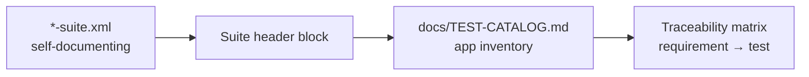

# MUnit Test Documentation Standard

> **Author:** Gonzalo Marcos · **Version:** 1.0 · **Date:** 2026-06-24 · **Status:** not validated · **Lang:** en

A standard for **documenting every test in a Mule application** so the test base is discoverable,
auditable, and traceable — by a new engineer, a reviewer, or an AI agent — without reading the raw
XML.

This is the documentation companion to the [MUnit Testing Standard](./MUNIT-TESTING-STANDARD.md):
that standard governs *what to test and how*; **this one governs how those tests are described,
inventoried, and kept in sync**. Both share the same conventions (`<flow>-suite.xml`,
`<flow>-should-<behaviour>`, archetypes, categories, 80% gate).

---

## Table of Contents

- [MUnit Test Documentation Standard](#munit-test-documentation-standard)
  - [Table of Contents](#table-of-contents)
  - [1. Why document tests](#1-why-document-tests)
  - [2. The three documentation layers](#2-the-three-documentation-layers)
  - [3. Layer 1 — In-suite (self-documenting XML)](#3-layer-1--in-suite-self-documenting-xml)
  - [4. Layer 2 — Suite header block](#4-layer-2--suite-header-block)
  - [5. Layer 3 — App-level test catalog](#5-layer-3--app-level-test-catalog)
    - [5.1 Catalog overview header](#51-catalog-overview-header)
    - [5.2 Per-suite table (the core artifact)](#52-per-suite-table-the-core-artifact)
    - [5.3 Coverage-gap section](#53-coverage-gap-section)
  - [6. Traceability matrix](#6-traceability-matrix)
  - [7. Test ID convention](#7-test-id-convention)
  - [8. Maintenance \& automation](#8-maintenance--automation)
  - [9. AI-Agent documentation contract](#9-ai-agent-documentation-contract)
    - [9.1 Inputs](#91-inputs)
    - [9.2 Procedure](#92-procedure)
    - [9.3 Prompt template](#93-prompt-template)
    - [9.4 Guardrails](#94-guardrails)
  - [10. References](#10-references)

---

## 1. Why document tests

> [!IMPORTANT]
> A test you cannot find, understand, or trace to a requirement is a test nobody trusts and nobody
> maintains. Documentation is what turns a folder of `*-suite.xml` files into an auditable safety net.

Test documentation must answer four questions for **any** app, fast:

1. **What is covered?** — which flows/units have tests, and which don't.
2. **What does each test prove?** — its intent, inputs, mocks, and expected outcome.
3. **Why does it exist?** — the requirement, branch, or bug it traces to.
4. **Is it current?** — does the doc still match the suite XML.

---

## 2. The three documentation layers

Documentation lives at three levels, each with a different audience. All three are **required**.

| Layer | Lives in | Audience | Source of truth for |
| --- | --- | --- | --- |
| **1. In-suite** | the `*-suite.xml` itself | the developer editing the test | exact behaviour, inputs, mocks |
| **2. Suite header** | a comment block at the top of each suite | reviewer scanning one suite | the suite's purpose & unit under test |
| **3. App catalog** | `docs/TEST-CATALOG.md` | architect, QA, onboarding, audit | the whole app's test inventory + traceability |



> [!TIP]
> Layers 2 and 3 are **derivable** from Layer 1. Keep Layer 1 rich, and the rest can be generated
> (see §8). Never let the catalog become hand-maintained prose that drifts from the XML.

---

## 3. Layer 1 — In-suite (self-documenting XML)

The XML is the primary record. Make it read like documentation.

**Required:**

- **`munit:config`** carries a one-line suite purpose via `doc:name`.
- **`munit:test name`** = the Test ID (§7); **`description`** = a full sentence stating the expected
  behaviour (this is *not* optional — it is the test's one-line spec).
- **Given/When/Then comments** delimit the three blocks.
- **Each mock and each assert** carries a `doc:name` describing intent, not mechanics
  (`Mock post-alert returns 200`, not `mock-when`).

```xml
<munit:test name="route-order-should-notify-when-amount-over-threshold"
            description="An order with amount greater than 100 triggers exactly one notification HTTP call and returns ack=ok.">
    <!-- GIVEN: an order over the notification threshold -->
    <munit:behavior>
        <munit:set-event doc:name="Input: order amount 250"> ... </munit:set-event>
        <munit-tools:mock-when processor="http:request" doc:name="Mock post-alert returns 200"> ... </munit-tools:mock-when>
    </munit:behavior>
    <!-- WHEN: the routing flow runs -->
    <munit:execution>
        <flow-ref name="route-order-flow"/>
    </munit:execution>
    <!-- THEN: ack is ok and the alert was called once -->
    <munit:validation>
        <munit-tools:assert-that doc:name="Assert ack == ok" ... />
        <munit-tools:verify-call doc:name="Verify post-alert called once" times="1" ... />
    </munit:validation>
</munit:test>
```

---

## 4. Layer 2 — Suite header block

Every `*-suite.xml` opens with a standard XML comment block. This is what a reviewer reads first.
Keep it to fields that don't drift faster than the suite itself.

```xml
<!--
  ============================================================
  Suite:        route-order-suite
  Unit(s):      route-order-flow            (orchestration / choice)
  Source:       src/main/mule/route-order.xml
  Purpose:      Verify amount-threshold notification routing.
  Collaborators mocked: http:request (post-alert)
  Tags:         smoke, regression, error
  Coverage:     route-order-flow — happy, negative, error paths
  Last reviewed: 2026-06-24  (Gonzalo Marcos)
  ============================================================
-->
```

**Rules:**

- `Unit(s)` lists each flow tested + its archetype (per [Testing Standard §3](./MUNIT-TESTING-STANDARD.md#3-unit-archetype--mandatory-test-matrix)).
- `Tags` mirrors the tags actually used in the tests.
- `Last reviewed` is a date + author, updated on any substantive edit.

---

## 5. Layer 3 — App-level test catalog

One file per application: **`docs/TEST-CATALOG.md`**. It is the single inventory of every test in
the app. Structure: an overview, then **one section per suite**, each with a table of its tests.

### 5.1 Catalog overview header

```markdown
# Test Catalog — <app-name>

| Metric | Value |
| --- | --- |
| Suites | 7 |
| Tests | 42 |
| Units covered | 12 / 14 |
| Line coverage | 86% (gate 80%) |
| Last generated | 2026-06-24 |
```

### 5.2 Per-suite table (the core artifact)

Each test is one row. These columns are **mandatory**:

| Test ID | Unit | Category | Given (inputs) | Mocks | Then (expected) | Tags |
| --- | --- | --- | --- | --- | --- | --- |
| `route-order-should-notify-when-amount-over-threshold` | route-order-flow | happy / branch>100 | amount = 250 | post-alert → 200 | ack=ok · post-alert called ×1 | smoke, regression |
| `route-order-should-not-notify-when-amount-under-threshold` | route-order-flow | negative / branch≤100 | amount = 25 | post-alert (defence) | ack=ok · post-alert called ×0 | smoke, regression |
| `route-order-should-propagate-when-notification-fails` | route-order-flow | error path | amount = 250 | post-alert → connectivity error | HTTP:CONNECTIVITY propagated | error, regression |

**Column rules:**

- **Category** uses the [taxonomy](./MUNIT-TESTING-STANDARD.md#4-test-case-taxonomy--derivation-rules)
  vocabulary (happy / input-variant / boundary / branch / error / behavioural / negative).
- **Mocks** lists collaborator `doc:name` → canned result/error; `—` if none.
- **Then** states the assertion(s) and verification(s) in plain language.
- A unit with **no row anywhere** in the catalog is a coverage gap — flag it (§5.3).

### 5.3 Coverage-gap section

A required final section listing units present in the app but **not** in any suite, so gaps are
visible without diffing against the source:

```markdown
## Coverage gaps
| Unit | Archetype | Reason untested | Owner |
| --- | --- | --- | --- |
| audit-log-subflow | transformation | TODO — no suite yet | Gonzalo Marcos |
```

---

## 6. Traceability matrix

A table linking **what the business/spec asked for** to **the tests that prove it**. Lives in
`docs/TEST-CATALOG.md` (or a sibling `TRACEABILITY.md` for large apps).

| Requirement / Spec ref | Flow(s) | Test ID(s) | Status |
| --- | --- | --- | --- |
| RAML `POST /orders` returns 202 on success | route-order-flow | `route-order-should-notify-when-amount-over-threshold` | ✅ |
| Orders ≤ 100 must not notify | route-order-flow | `route-order-should-not-notify-when-amount-under-threshold` | ✅ |
| Notification failures must not lose the order | route-order-flow | `route-order-should-propagate-when-notification-fails` | ✅ |
| Audit every order | audit-log-subflow | — | ❌ gap |

> [!NOTE]
> Source the left column from the API spec (RAML/OAS operations + responses) and from the error
> mappings. Every spec'd behaviour must map to ≥ 1 test or be explicitly marked a gap.

---

## 7. Test ID convention

The **Test ID is the `munit:test name`** — no separate identifier to keep in sync.

```
<unit>-should-<behaviour>
```

- `<unit>` = the flow/sub-flow under test (kebab-case).
- `<behaviour>` = the expected outcome, readable as a sentence: "route-order **should** notify when
  amount over threshold".
- Negative cases use `should-not-…`; error cases use `should-propagate-…` / `should-map-…`.

This makes the ID **stable, greppable, and self-explanatory** — and it is the join key between all
three documentation layers.

---

## 8. Maintenance & automation

> [!WARNING]
> Hand-maintained test docs drift within weeks. The catalog (Layer 3) must be **generated from the
> suite XML** (Layer 1), not authored separately.

**Generation pipeline** (the suite XML is the source of truth):

1. Parse every `src/test/munit/*-suite.xml`: read `munit:config`, each `munit:test` `name` +
   `description`, the `set-event` inputs, each `mock-when`/`verify-call` (processor + `doc:name`),
   each assert, and the tags.
2. Emit/refresh `docs/TEST-CATALOG.md`: overview metrics, per-suite tables, coverage-gap section.
3. Cross-reference the **coverage report** (`munit-maven-plugin`, [Testing Standard §7](./MUNIT-TESTING-STANDARD.md#7-coverage-policy--definition-of-done)) for the metrics row.
4. Cross-reference the **API spec** (RAML/OAS) to build/refresh the traceability matrix.

**CI enforcement** (extend `munit-workflow.yaml`):

- Regenerate the catalog and **fail the build if `docs/TEST-CATALOG.md` is out of date** (the same
  pattern as a "generated files are stale" check) — guarantees docs never drift from tests.
- Fail if any unit appears as a **coverage gap** without an owner + reason.

**Definition of Done (documentation):**

- [ ] Every suite has a header block (Layer 2) with `Last reviewed`.
- [ ] Every test has a full-sentence `description` (Layer 1).
- [ ] `docs/TEST-CATALOG.md` is regenerated and committed; metrics match the coverage report.
- [ ] Coverage-gap section lists every untested unit with an owner.
- [ ] Traceability matrix maps every spec'd behaviour to a test or a flagged gap.

---

## 9. AI-Agent documentation contract

The agent that generates tests ([Testing Standard §8](./MUNIT-TESTING-STANDARD.md#8-ai-agent-contract))
also produces this documentation. This contract specifies the documentation output.

### 9.1 Inputs

| Artifact | Provides |
| --- | --- |
| `*-suite.xml` files | the tests to document (names, descriptions, inputs, mocks, asserts, tags) |
| Coverage report | metrics + which units are untested |
| RAML / OAS | requirements for the traceability matrix |
| App source XML | full unit list (to compute coverage gaps) |

### 9.2 Procedure

1. Parse each suite; for every test extract Test ID, unit, category (infer from name + structure),
   inputs, mocks, expected outcome, tags.
2. Emit the **suite header block** (Layer 2) into each suite if missing or stale.
3. Generate `docs/TEST-CATALOG.md`: overview, per-suite tables, coverage-gap section.
4. Build the **traceability matrix** from the API spec; mark unmapped behaviours as gaps.
5. Summarize what changed and list every gap flagged.

### 9.3 Prompt template

```text
You are a MUnit test-documentation agent. Follow the MUnit Test Documentation Standard v1.0.

INPUT: suiteFiles, coverageReport, apiSpec (optional), appSourceFiles.

PROCEDURE:
1. Parse each *-suite.xml. For every <munit:test>, extract: name (= Test ID), description, the
   set-event inputs, each mock-when/verify-call (processor + doc:name + canned result/error), each
   assertion, and tags. Infer the test Category from the taxonomy vocabulary.
2. Ensure each suite has the standard header comment block (Suite, Unit(s)+archetype, Source,
   Purpose, Collaborators mocked, Tags, Coverage, Last reviewed). Add or refresh it; do NOT change
   any test logic.
3. Generate docs/TEST-CATALOG.md: overview metrics (from coverageReport), one section per suite
   with the mandatory columns (Test ID | Unit | Category | Given | Mocks | Then | Tags), and a
   Coverage-gaps section listing app units with no test (with TODO owner/reason).
4. If apiSpec is provided, build a Traceability matrix mapping each spec'd operation/response/error
   to its Test ID(s); mark unmapped behaviours as gaps.

CONSTRAINTS:
- Document ONLY what the XML and reports contain. Do NOT invent behaviour, requirements, or results.
- Plain-language Then/Given columns; use the standard taxonomy vocabulary for Category.
- The catalog must be fully regenerable: no hand-written prose that the XML cannot reproduce.
- Flag every gap and every test missing a description as a TODO — never fabricate to fill a cell.

OUTPUT: the updated suite header blocks, docs/TEST-CATALOG.md, the traceability matrix, and a short
summary of changes + flagged gaps.
```

### 9.4 Guardrails

- **Generated, not authored** — the catalog is reproducible from suites + reports; no orphan prose.
- **Document only what exists** — no invented requirements or outcomes; unknowns become flagged TODOs.
- **Never edit test logic** while documenting — header blocks and `doc:name`s only.
- **Gaps are first-class** — an untested unit is documented as a gap, not silently omitted.

---

## 10. References

- [MUnit Testing Standard v1.0](./MUNIT-TESTING-STANDARD.md) — the companion "what/how to test" standard.
- [MUnit documentation](https://docs.mulesoft.com/munit/latest/) — official MUnit guide.
- [munit-maven-plugin](https://docs.mulesoft.com/munit/latest/munit-maven-plugin) — coverage reports used for catalog metrics.
- Internal: BlogGon MUnit series, [Posts 01–14](./posts).
