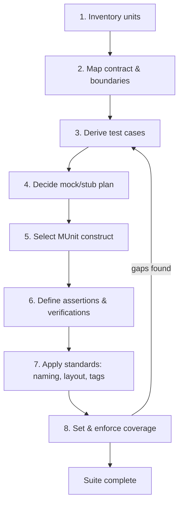

# MUnit Unit-Testing Standard & Methodology

> **Author:** Gonzalo Marcos · **Version:** 1.0 · **Date:** 2026-06-24 · **Status:** not validated · **Lang:** en

A repeatable, deterministic process for deciding **what** to test in a Mule application, **to what
depth**, and **how to structure it** with MUnit — standardized enough that (a) any two engineers
produce the same suites for the same flow, and (b) an AI agent can execute the process to generate
those suites automatically.

This document is the layer *above* the [BlogGon MUnit series](./posts). The series teaches the
**mechanics** of each feature; this standard governs the **strategy** that decides which mechanics
to apply, where, and why. Throughout, sections link to the post that teaches the referenced feature.

---

## Table of Contents

1. [Scope & Definitions](#1-scope--definitions)
2. [The Methodology — 8-Step Pipeline](#2-the-methodology--8-step-pipeline)
3. [Unit Archetype → Mandatory Test Matrix](#3-unit-archetype--mandatory-test-matrix)
4. [Test-Case Taxonomy & Derivation Rules](#4-test-case-taxonomy--derivation-rules)
5. [MUnit Feature-Selection Matrix](#5-munit-feature-selection-matrix)
6. [Standards & Conventions](#6-standards--conventions)
7. [Coverage Policy & Definition of Done](#7-coverage-policy--definition-of-done)
8. [AI-Agent Contract](#8-ai-agent-contract)
9. [References](#9-references)

---

## 1. Scope & Definitions

### 1.1 What is a "unit" in MUnit?

> [!IMPORTANT]
> The **unit under test (SUT)** is a single Mule **flow**, **sub-flow**, or **error handler** —
> never a whole application, and never a single processor in isolation.

A unit is the smallest independently-referenceable piece of Mule logic you can drive with a
`<flow-ref>`. Choosing the right granularity is the first discipline of the methodology: if you
cannot name the unit, you cannot name its contract, and you cannot derive its tests.

### 1.2 Glossary

| Term | Definition |
| --- | --- |
| **Suite** | One `*-suite.xml` file containing the tests for one production flow file or feature. |
| **Test** | One `<munit:test>` — exercises one logical concern of one unit. |
| **SUT** | System Under Test — the flow/sub-flow/error-handler being exercised. |
| **Collaborator** | Anything the SUT calls across its boundary: HTTP requester, DB, Salesforce, MQ, a sub-flow that reaches an external system. |
| **Boundary** | The line between "logic owned by this unit" and "everything it delegates to". |
| **Mock** | A stand-in for a collaborator that returns a canned result or raises a canned error ([Post 05](./posts/05-mocking-external-calls-with-mock-when.md), [Post 10](./posts/10-testing-errors-and-error-handlers.md)). |
| **Spy** | A non-intrusive probe that asserts on the message *mid-flow*, before/after a processor ([Post 09](./posts/09-inspecting-mid-flow-with-spy.md)). |
| **Fixture** | Reusable setup/teardown (sample payloads, seeded vars) factored into before/after scopes ([Post 07](./posts/07-before-and-after-lifecycle-scopes.md)). |
| **Assertion** | A *state-based* check on the resulting message ([Post 03](./posts/03-munit-assertions-the-full-toolbox.md), [Post 04](./posts/04-assert-that-and-the-hamcrest-matchers.md)). |
| **Verification** | A *behaviour-based* check that a collaborator was/wasn't called ([Post 06](./posts/06-verify-call-did-the-flow-actually-call-that.md)). |

### 1.3 The isolation principle

> [!TIP]
> A unit test exercises **one** unit and mocks **everything across its boundary**, so the test is
> **deterministic and fully offline**.

Concretely:

- **Mock** every external collaborator (HTTP, DB, connectors, MQ, external sub-flows).
- **Leave real** only pure in-memory logic the unit *owns* — DataWeave transforms, choice routing,
  variable manipulation.
- No real network, no real clock dependence, no shared mutable state between tests.

### 1.4 Out of scope

This standard governs **unit** testing only. The following are a *separate* testing layer and are
**not** covered here:

- **Integration tests** (real connectors against sandboxes).
- **End-to-end / API functional tests** (Postman → Newman → CI, per `gon_notes.md` next series).
- **Performance / load tests.**

---

## 2. The Methodology — 8-Step Pipeline

Run these eight steps **in order** for every unit. Each step declares **Input → Action → Output**,
which is what makes the process both human-repeatable and agent-executable.



### Step 1 — Inventory units
- **Input:** the Mule application (`src/main/mule/*.xml`).
- **Action:** list every `<flow>`, `<sub-flow>`, and error handler. Classify each by **archetype**
  (§3).
- **Output:** a table of `unit name | archetype | source file`.

### Step 2 — Map the contract & boundaries
- **Input:** one unit's XML.
- **Action:** record, for that unit:
  - **Inputs:** payload, attributes, vars, query/uri params, headers.
  - **Outputs:** resulting payload shape, attributes, vars.
  - **Payload flow:** how `payload` changes through the unit. A mocked **return** overwrites
    `payload` (unless `target` is set); a mocked **error** does not. Per path (success vs error),
    note which fields still exist at the assertion point.
  - **Collaborators to mock:** every processor that crosses the boundary (with its `doc:name`).
  - **Branches:** each `choice/when`, `scatter-gather`, `for-each`.
  - **Errors:** every error type the unit *raises* or its handler *catches*.
- **Output:** a per-unit **contract sheet**.

### Step 3 — Derive test cases
- **Input:** the contract sheet.
- **Action:** apply the taxonomy rules (§4) mechanically — one case per happy outcome, per branch,
  per error type, per input equivalence class + boundary value, plus behavioural checks.
- **Output:** a list of named test cases (`should-<behaviour>`), each with its intent.

### Step 4 — Decide the mock/stub plan
- **Input:** the collaborators list (Step 2) and the test cases (Step 3).
- **Action:** for each collaborator in each test, decide: **mock-return** / **mock-error** /
  **spy** / **leave-real** (per the rule table below).
- **Output:** a mock plan per test case.

| Collaborator situation | Decision |
| --- | --- |
| External call on the happy path | **mock-return** a canned success |
| External call whose failure you are testing | **mock-error** raising the expected error type |
| Call you must prove happened (or didn't) | mock it **and** add a **verify-call** |
| Intermediate message state you must inspect | **spy** before/after the processor |
| Pure in-memory transform / routing owned by the unit | **leave-real** |

### Step 5 — Select the MUnit construct
- **Input:** each test case's intent.
- **Action:** look up the intent in the **feature-selection matrix** (§5) and pick the construct.
- **Output:** the construct list per test (set-event, mock-when, assert-*, verify-call, spy, …).

### Step 6 — Define assertions & verifications
- **Input:** the construct list + expected outputs.
- **Action:** write **state-based** checks (`assert-equals` / `assert-that` + Hamcrest) and
  **behaviour-based** checks (`verify-call`). One logical concern per test. Order each test
  **Given → When → Then** (`<munit:behavior>` → `<munit:execution>` → `<munit:validation>`).
- **Output:** complete `<munit:test>` bodies.

### Step 7 — Apply standards
- **Input:** the test bodies.
- **Action:** apply naming, file layout, tags, fixtures, parameterization rules (§6).
- **Output:** a standards-compliant `*-suite.xml`.

### Step 8 — Set & enforce coverage
- **Input:** the finished suites.
- **Action:** run with coverage; confirm the **80% gate** and the **mandatory-coverage rules**
  (§7) pass; wire into CI (`munit-workflow.yaml`). If gaps remain, **loop back to Step 3**.
- **Output:** a green, gated build.

---

## 3. Unit Archetype → Mandatory Test Matrix

Given a unit's archetype, the **required** test set is fixed. This table is the core "what to test"
decision aid — it removes judgement from coverage of the common cases.

| Archetype | Description | Mandatory test categories | Typical mocks |
| --- | --- | --- | --- |
| **API listener / entry flow** | HTTP listener that receives a request and orchestrates a response | Happy path · input variants · each error → mapped HTTP status | the orchestration sub-flows / downstream calls |
| **Orchestration flow** | Calls several collaborators and composes a result | Happy path · each collaborator failure path · behavioural verify of each call | every downstream call |
| **Transformation sub-flow** | Pure DataWeave shaping, no external calls | Happy path · input equivalence classes · boundary values (empty/null/max) | none (leave-real) |
| **Integration / connector flow** | Wraps a single connector op (DB, SF, HTTP, MQ) | Happy path · connectivity error · empty-result · verify-call cardinality | the connector op |
| **Choice / router flow** | Routes by a condition | **One test per branch** + default branch | calls inside each branch |
| **Scatter-gather / parallel flow** | Fans out and aggregates | Happy aggregate · one-route-fails path · verify all routes called | each route's call |
| **For-each / batch flow** | Iterates a collection | Empty collection · single item · many items · mid-iteration error | per-item call |
| **Scheduler-triggered flow** | Runs on a timer | Happy run · downstream failure path (no input variants needed) | downstream calls |
| **Error handler / on-error scope** | `on-error-continue` / `on-error-propagate` | One test per caught error type · correct mapping/propagation · verify compensating calls | the failing collaborator (mock-error) |

> [!NOTE]
> A unit may match more than one archetype (e.g. an API flow that also routes). In that case the
> mandatory categories are the **union** of all matching rows.

---

## 4. Test-Case Taxonomy & Derivation Rules

Each category has a **trigger rule** so derivation is mechanical, not a matter of taste. For a
given contract sheet, generate one test for every trigger that fires.

| Category | Trigger rule (generate a test when…) | Primary technique |
| --- | --- | --- |
| **Happy path** | the unit has a successful outcome branch | set-event + assert output |
| **Input variant** | an input field has meaningful equivalence classes | partition the field, one test per class |
| **Boundary value** | an input field has limits (length, range, optionality) | empty, null, min, max, just-over-max |
| **Branch** | the unit has a `choice/when` or default route | one test per route |
| **Error path** | the unit raises or its handler catches an error type | mock-error + assert error type/mapping |
| **Behavioural** | a collaborator *must* (or must *not*) be called | verify-call with `times` |
| **Negative** | a condition should produce "no action" | assert no change + verify-call `times="0"` |

### 4.1 Worked example — `route-order-flow` (notify if amount > 100)

A flow that posts an alert (HTTP `post-alert`) only when `payload.amount > 100`, then returns
`{ ack: "ok" }`. Walking the rules against its contract sheet reproduces the two happy/negative
tests the series wrote verbatim in [Post 06](./posts/06-verify-call-did-the-flow-actually-call-that.md),
and derives the error-path test using the technique from [Post 10](./posts/10-testing-errors-and-error-handlers.md):

| Test name | Category | Mock plan | Checks |
| --- | --- | --- | --- |
| `route-order-should-notify-when-amount-over-threshold` | Happy + Branch (>100) | mock `post-alert` → success | assert `ack == "ok"` · **verify** `post-alert` `times="1"` |
| `route-order-should-not-notify-when-amount-under-threshold` | Negative + Branch (≤100) | mock `post-alert` (defence) | assert `ack == "ok"` · **verify** `post-alert` `times="0"` |
| `route-order-should-propagate-when-notification-fails` | Error path | mock `post-alert` → connectivity error | assert error type propagated |

> [!TIP]
> If your derivation reproduces the tests an experienced engineer would have written by hand, the
> process is sound. This worked example is the methodology's self-check (see §Verification intent).

> [!WARNING]
> **Only assert fields that survive to the assertion point.** A mocked external call's *return*
> replaces `payload` (e.g. an `http:request` mock overwrites the message with its canned response),
> so fields produced *before* that call are gone on the success path — but preserved on a
> mocked-*error* path (the failing call never replaces `payload`). Derive each path's assertions
> from the payload as it actually exists there (see §2 Step 2, **Payload flow**).

---

## 5. MUnit Feature-Selection Matrix

Pick the construct by **intent**, not by habit. This guarantees the right tool per test concern.

| Test intent | MUnit construct | Namespace | Teaching post |
| --- | --- | --- | --- |
| Provide payload / attributes / vars / params | `<munit:set-event>` | `munit` | [02](./posts/02-set-event-and-test-inputs.md) |
| Replace an external call with a canned result | `<munit-tools:mock-when>` | `munit-tools` | [05](./posts/05-mocking-external-calls-with-mock-when.md) |
| Make an external call raise an error | `<munit-tools:mock-when>` + `<munit-tools:then-return error=…>` | `munit-tools` | [10](./posts/10-testing-errors-and-error-handlers.md) |
| Assert the unit raises / propagates an error | `expectedErrorType` (+ optional `expectedErrorDescription`, exact match) on `<munit:test>` | `munit` | [10](./posts/10-testing-errors-and-error-handlers.md) |
| Assert an exact output value | `<munit-tools:assert-equals>` | `munit-tools` | [03](./posts/03-munit-assertions-the-full-toolbox.md) |
| Assert with a flexible matcher | `<munit-tools:assert-that … is>` + Hamcrest | `munit-tools` | [04](./posts/04-assert-that-and-the-hamcrest-matchers.md) |
| Assert mid-flow message state | `<munit-tools:spy>` | `munit-tools` | [09](./posts/09-inspecting-mid-flow-with-spy.md) |
| Prove a collaborator was/wasn't called | `<munit-tools:verify-call times=…>` | `munit-tools` | [06](./posts/06-verify-call-did-the-flow-actually-call-that.md) |
| Share setup/teardown across tests | `<munit:before-*>` / `<munit:after-*>` | `munit` | [07](./posts/07-before-and-after-lifecycle-scopes.md) |
| Same logic, many input rows | `<munit:parameterizations>` | `munit` | [11](./posts/11-parameterized-suites-one-test-many-inputs.md) |
| Remove duplication / group runs | extract fixtures + tags | `munit` | [12](./posts/12-refactoring-tests-reuse-tags-and-suite-hygiene.md) |
| Scaffold a test from a real run | MUnit Recorder | (IDE) | [08](./posts/08-recording-tests-with-the-munit-recorder.md) |

> [!NOTE]
> **Error-path tests assert via attributes, not the validation block.** To assert that a unit raises
> or propagates an error, set `expectedErrorType` (and optionally `expectedErrorDescription`, an
> *exact* match) on `<munit:test>`. The flow aborts at `<munit:execution>`, so the
> `<munit:validation>` block does **not** run — leave it empty; do not put asserts or `verify-call`
> there. To verify a compensating call on failure, the error must be *caught* (e.g.
> `on-error-continue`) so the flow completes and validation runs.

---

## 6. Standards & Conventions

These are the **enforceable** rules. A suite that violates them fails review.

### 6.1 Naming

- **Suite file:** `<flow-or-feature>-suite.xml` (e.g. `route-order-suite.xml`).
- **Test name:** `<flow>-should-<behaviour>` in kebab-case
  (e.g. `route-order-should-notify-when-amount-over-threshold`).
- **`description`:** a full human sentence stating the expected behaviour.
- **Scope names:** `<action>-<scope>` (e.g. `load-catalog-fixture-before-suite`,
  `clear-catalog-after-test`).

### 6.2 Structure (Given / When / Then)

Every test follows the three MUnit blocks, in order:

```xml
<munit:test name="route-order-should-notify-when-amount-over-threshold"
            description="Order with amount > 100 should trigger exactly one notification HTTP call">

    <munit:behavior>   <!-- GIVEN: inputs + mocks -->
        <munit:set-event doc:name="Set Event with big amount">
            <munit:payload value='#[%dw 2.0 output application/json --- { amount: 250 }]'
                           mediaType="application/json"/>
        </munit:set-event>

        <munit-tools:mock-when processor="http:request">
            <munit-tools:with-attributes>
                <munit-tools:with-attribute attributeName="doc:name" whereValue="#['post-alert']"/>
            </munit-tools:with-attributes>
            <!-- then-return … -->
        </munit-tools:mock-when>
    </munit:behavior>

    <munit:execution>  <!-- WHEN: run the unit -->
        <flow-ref name="route-order-flow"/>
    </munit:execution>

    <munit:validation> <!-- THEN: assert state + verify behaviour -->
        <munit-tools:assert-that expression="#[payload.ack]"
                                 is='#[MunitTools::equalTo("ok")]'/>
        <munit-tools:verify-call processor="http:request" times="1">
            <munit-tools:with-attributes>
                <munit-tools:with-attribute attributeName="doc:name" whereValue="#['post-alert']"/>
            </munit-tools:with-attributes>
        </munit-tools:verify-call>
    </munit:validation>

</munit:test>
```

**Rules:**

- **One suite per production flow file** (or per cohesive feature).
- **One logical concern per test** — if a test name needs "and", split it.
- Mocks and inputs go in `<munit:behavior>`; the `flow-ref` in `<munit:execution>`; all checks in
  `<munit:validation>`.
- Both `whereValue="#['post-alert']"` (expression) and `whereValue="post-alert"` (plain string) are
  valid for matching a processor's `doc:name`; the MUnit Recorder emits the plain form.

### 6.3 Tags

Standardized tag set for selective runs (`munit.tags` / `-Dmunit.tags`):

| Tag | Meaning |
| --- | --- |
| `smoke` | minimal fast set, run on every push |
| `regression` | full set, run pre-merge |
| `error` | error-path tests |
| `integration` | tests that, exceptionally, touch a real collaborator (rare; usually excluded from unit runs) |

### 6.4 Fixtures & resources

- Sample payloads live under `src/test/resources/…` and are loaded via fixtures.
- Shared mock setup goes in **before-scopes**, not copy-pasted per test ([Post 07](./posts/07-before-and-after-lifecycle-scopes.md)).
- Large expected payloads use the **golden-file** pattern ([Post 03](./posts/03-munit-assertions-the-full-toolbox.md)).

### 6.5 Parameterization

> [!TIP]
> When **≥ 3** tests differ only by input/expected data, convert them to a **parameterized suite**
> ([Post 11](./posts/11-parameterized-suites-one-test-many-inputs.md)). Below 3, keep them inline.

> [!IMPORTANT]
> `<munit:parameterizations>` is a child of **`<munit:config>`**, *not* of `<munit:test>` — it is
> **suite-scoped**: the *entire* suite re-runs once per parameterization, and each `propertyName` is
> referenced inside the tests with `${propName}`. (Verified against the MUnit 3.6 `mule-munit.xsd`;
> placement is version-specific.) Nesting `<munit:parameterizations>` inside a `<munit:test>` is
> schema-invalid and crashes the Anypoint Studio visual editor.
>
> **One parameterization set per suite.** If a flow file needs ≥ 2 independent data-driven groups,
> or a mix of data-driven and non-data-driven tests, under the "one suite per flow file" rule
> (§6.2), implement those cases as **explicit per-case tests** (or split into separate suites) —
> never nest `parameterizations` in a test.

```xml
<munit:config name="validate-email-suite" minMuleVersion="4.9.0">
    <munit:parameterizations>
        <munit:parameterization name="valid-standard">
            <munit:parameters>
                <munit:parameter propertyName="email"         value="gon@example.com"/>
                <munit:parameter propertyName="expectedValid" value="#[true]"/>
            </munit:parameters>
        </munit:parameterization>
        <munit:parameterization name="missing-at">
            <munit:parameters>
                <munit:parameter propertyName="email"         value="gon.example.com"/>
                <munit:parameter propertyName="expectedValid" value="#[false]"/>
            </munit:parameters>
        </munit:parameterization>
    </munit:parameterizations>
</munit:config>
```

### 6.6 Determinism rules

- No real network calls — every boundary collaborator is mocked.
- Dynamic ports for any embedded listener.
- No assertions on `now()` / `Math.random()` / UUIDs without freezing or matcher-based checks.
- Never assume **DataWeave / runtime evaluation semantics** (null comparisons such as `null > n`,
  type coercions, `as` casts, missing-key access). Verify the actual result by running, or flag it
  as an Open Question — do not assert a guessed outcome.
- Tests must pass in any order and in isolation (no inter-test shared mutable state).

---

## 7. Coverage Policy & Definition of Done

### 7.1 Coverage gate

- **80%** application coverage, enforced as a **build-failure threshold** in the
  `munit-maven-plugin` ([Post 13](./posts/13-the-munit-plugin-configuration-that-matters.md)) and
  in CI (`munit-workflow.yaml`, [Post 14](./posts/14-automating-munit-with-github-actions-and-enforcing-coverage.md)).

### 7.2 Mandatory-coverage rules (beyond the %)

The percentage is necessary but not sufficient. These rules are **always** required:

- ✅ Every **error handler** has at least one test.
- ✅ Every **choice branch** (including default) is hit by a test.
- ✅ Every flow with **external calls** has at least one **mock** and one **verify-call**.
- ✅ Every **public API entry flow** has a happy path + at least one error→status mapping test.

### 7.3 Definition of Done (suite review checklist)

Before merge, a suite must satisfy:

- [ ] One suite per production flow file; named `<flow>-suite.xml`.
- [ ] Every unit from the archetype matrix (§3) has its mandatory categories covered.
- [ ] Test names are `<flow>-should-<behaviour>`; each `description` is a full sentence.
- [ ] Each test asserts **one** logical concern, in Given/When/Then order.
- [ ] All boundary collaborators are mocked; the suite runs offline and in any order.
- [ ] Error paths, branches, and "no-action" negatives are covered.
- [ ] ≥ 3 data-only duplicates are parameterized.
- [ ] Coverage gate (80%) and mandatory-coverage rules pass.
- [ ] Tags applied (`smoke`/`regression`/`error`).

---

## 8. AI-Agent Contract

This section makes the methodology **machine-executable**: an agent given a flow file and the
inputs below runs the §2 pipeline.

> [!IMPORTANT]
> **Two-phase, plan-first workflow.** The agent never jumps straight to writing tests. It runs in
> two phases with a **human validation gate** between them:
>
> | Phase | Agent does | Output | Gate |
> | --- | --- | --- | --- |
> | **1 — Test Design** | pipeline Steps 1–6 (inventory → contract → derive → mock-plan → construct → asserts) | a **Test Design Document** written to **`docs/TEST-DESIGN.md`** (§8.3) | **human reads the file, validates & approves** |
> | **2 — Implementation** | pipeline Steps 5–7 from the *approved* design | the `*-suite.xml` files + catalog (§8.4) | suite review (DoD §7.3) |
>
> Phase 1 lets the team confirm *what will be tested* before a single line of XML is written. In
> Phase 1 the agent's **only** filesystem change is writing `docs/TEST-DESIGN.md` — it must **not**
> write any suite XML, modify the Mule app, or change any other file.

### 8.1 Inputs the agent ingests

| Artifact | Provides |
| --- | --- |
| Flow XML (`src/main/mule/*.xml`) | the units, their processors, branches, `doc:name`s, error handling |
| Global config XML | connector configs, so the agent knows what crosses the boundary |
| `pom.xml` | connector dependencies + Mule runtime version (for correct namespaces) |
| RAML / OAS (if any) | the API contract → expected status codes & response shapes |
| Example payloads | realistic set-event inputs and golden outputs |
| Existing `*-suite.xml` | conventions in use + what is already covered (avoid duplication) |

**Input manifest schema** (what the agent receives):

```json
{
  "$schema": "https://json-schema.org/draft/2020-12/schema",
  "type": "object",
  "required": ["targetFlowFile", "muleVersion", "sourceFiles"],
  "properties": {
    "targetFlowFile": { "type": "string", "description": "path to the flow XML to generate tests for" },
    "muleVersion":    { "type": "string", "enum": ["4.6", "4.8", "4.9", "4.x"] },
    "coverageTarget": { "type": "number", "default": 80 },
    "sourceFiles":    { "type": "array", "items": { "type": "string" } },
    "globalConfigs":  { "type": "array", "items": { "type": "string" } },
    "apiSpec":        { "type": "string", "description": "path to RAML/OAS, optional" },
    "examplePayloads":{ "type": "array", "items": { "type": "string" } },
    "existingSuites": { "type": "array", "items": { "type": "string" } }
  }
}
```

### 8.2 Phase 1 — Test Design procedure (writes only the design doc)

The agent follows §2 Steps 1–6 in order, showing its work for each, and **writes the Test Design
Document to `docs/TEST-DESIGN.md`** (§8.3 format) so the team can read it carefully and validate it.
That markdown file is its **only** filesystem change — it writes **no** suite XML, makes **no**
changes to the Mule app, and modifies **no** other file in this phase.

1. **Inventory** the units in `targetFlowFile`; classify each by archetype (§3).
2. **Map** each unit's contract sheet (inputs, outputs, collaborators+`doc:name`, branches, errors).
3. **Derive** test cases by applying §4 trigger rules **and** the §3 mandatory categories.
4. **Plan mocks** per test using the §4 decision table.
5. **Select** the construct per test from the §5 matrix.
6. **Specify** assertions (state) + verifications (behaviour) in plain language — one concern per test.

Every ambiguity (intent not derivable from the app) is recorded under **Open Questions**, never
guessed. The document is then handed to a human to **validate and approve** before Phase 2.

### 8.3 The Test Design Document (the validation gate)

The Phase 1 deliverable, **written to `docs/TEST-DESIGN.md`** as a standalone markdown file you read
and approve. It states *what will be tested and why* — in human-readable form, no XML — so the team
can validate coverage before implementation. Its format is also defined, identically, in
[Documentation Standard §5.4](./MUNIT-TEST-DOCUMENTATION-STANDARD.md#54-the-test-design-document-pre-implementation).
Required sections:

1. **Summary** — app + `targetFlowFile`, units found, total proposed tests, coverage intent, runtime.
2. **Unit inventory** — table `Unit | Archetype | Source`.
3. **Per unit**, two artifacts:
   - **Contract sheet** — inputs, outputs, boundary collaborators (mock) vs owned (real), branches, errors.
   - **Proposed tests** — table with columns:
     `Test ID | Category | Trigger | Given (input) | Mocks | Then (assert + verify) | Tags | Parameterized?`
4. **Coverage & mandatory-rules check** — table mapping each §7 mandatory rule → the test(s) that satisfy it; list any gaps.
5. **Traceability** — if an API spec is supplied, map each spec'd behaviour/status to its proposed Test ID(s).
6. **Open Questions** — every ambiguity/assumption requiring a human decision, as an explicit checklist.

> [!NOTE]
> The proposed-tests table uses the **same columns** as the implemented-test catalog
> ([Documentation Standard §5.2](./MUNIT-TEST-DOCUMENTATION-STANDARD.md#52-per-suite-table-the-core-artifact)),
> plus `Trigger` and `Parameterized?`. After Phase 2, the approved design *becomes* the catalog — no
> rework, just promotion from "proposed" to "implemented".

### 8.4 Phase 2 — Implementation: output contract (after approval)

Only after the Test Design Document is approved. The agent now runs §2 Steps 5–7 from the
**approved** design and emits one `<flow>-suite.xml` per production flow file (plus the catalog),
using namespaces matching the runtime and only the connector namespaces actually used. It must not
add, drop, or alter tests relative to the approved design without flagging the change.

> [!IMPORTANT]
> **Run & reconcile (§2 Step 8 made explicit).** After emitting the suite the agent **runs it** and
> resolves every failure/error before delivering:
> - a **test bug** → fix the test;
> - a **wrong design assumption** (the app does something other than the design predicted) → correct
>   the test to the *observed* behaviour, update the Test Design Document **and** the catalog, and
>   **flag** the correction.
>
> Never deliver a red suite, and never assert behaviour the run contradicts. A corrected assumption
> is the only sanctioned reason to deviate from the approved design (still flagged, per above).

```xml
<?xml version="1.0" encoding="UTF-8"?>
<mule xmlns="http://www.mulesoft.org/schema/mule/core"
      xmlns:doc="http://www.mulesoft.org/schema/mule/documentation"
      xmlns:munit="http://www.mulesoft.org/schema/mule/munit"
      xmlns:munit-tools="http://www.mulesoft.org/schema/mule/munit-tools"
      xmlns:http="http://www.mulesoft.org/schema/mule/http"
      xmlns:xsi="http://www.w3.org/2001/XMLSchema-instance"
      xsi:schemaLocation="
        http://www.mulesoft.org/schema/mule/core
          http://www.mulesoft.org/schema/mule/core/current/mule.xsd
        http://www.mulesoft.org/schema/mule/munit
          http://www.mulesoft.org/schema/mule/munit/current/mule-munit.xsd
        http://www.mulesoft.org/schema/mule/munit-tools
          http://www.mulesoft.org/schema/mule/munit-tools/current/mule-munit-tools.xsd
        http://www.mulesoft.org/schema/mule/http
          http://www.mulesoft.org/schema/mule/http/current/mule-http.xsd">

    <munit:config name="route-order-suite" minMuleVersion="4.9.0"/>

    <!-- before-suite / before-test fixtures here -->

    <munit:test name="route-order-should-..." description="...">
        <munit:behavior>   <!-- set-event + mock-when --> </munit:behavior>
        <munit:execution>  <flow-ref name="route-order-flow"/> </munit:execution>
        <munit:validation> <!-- assert-* + verify-call --> </munit:validation>
    </munit:test>

</mule>
```

**Per-test emission template** the agent fills for each derived case:

```xml
<munit:test name="{flow}-should-{behaviour}" description="{full sentence}">
    <munit:behavior>
        <munit:set-event>{inputs from contract sheet}</munit:set-event>
        {one mock-when per mocked collaborator}
    </munit:behavior>
    <munit:execution><flow-ref name="{flow}"/></munit:execution>
    <munit:validation>
        {assert-equals / assert-that per expected output}
        {verify-call per behavioural check}
    </munit:validation>
</munit:test>
```

### 8.5 Prompts

Two copy-pasteable prompts, one per phase. Substitute the `{…}` slots (or, in an agentic tool that
can read the repo, just give the file paths and the agent reads them).

**Prompt A — Phase 1: Test Design.** This is the prompt you start with. Its single output is the
`docs/TEST-DESIGN.md` file, which you then read and validate.

```text
Read MUNIT-TESTING-STANDARD.md and MUNIT-TEST-DOCUMENTATION-STANDARD.md in this repo and follow
them exactly. Do NOT build or modify the Mule app and do NOT write any suite XML. Your ONLY change
this turn is to write a Test Design Document to docs/TEST-DESIGN.md for me to read and validate.

TARGET app file(s): {targetFlowFile}.
CONTEXT: muleVersion={muleVersion}; coverageTarget={coverageTarget}; globalConfigs={...};
apiSpec={... or none}; examplePayloads={... or none}; existingSuites={... or none}.

Follow the Phase 1 procedure (Testing Standard §8.2):
1. Inventory the units in the target file(s); classify each by archetype (§3).
2. Build a contract sheet per unit: inputs, outputs, boundary collaborators (to mock) vs owned
   logic (leave real), branches, error types raised/caught, and the PAYLOAD FLOW — a mocked return
   overwrites `payload`, a mocked error does not, so record which fields survive at the assertion
   point on each path.
3. Derive test cases: taxonomy triggers (§4) + the mandatory categories for each archetype (§3).
4. Plan mocks per test (mock-return / mock-error / spy / leave-real).
5. Note the MUnit construct per test (feature-selection matrix §5).
6. Specify assertions (state) and verifications (behaviour) in plain language — one concern per test.

WRITE docs/TEST-DESIGN.md in the §8.3 / Documentation Standard §5.4 format — Summary, Unit
inventory, per-unit Contract sheet + Proposed-tests table (Test ID | Category | Trigger | Given |
Mocks | Then | Tags | Parameterized?), Coverage & mandatory-rules check, Traceability to the API
spec, and an Open Questions list.

HARD RULES:
- Only test logic that EXISTS in the app. NEVER invent behaviour. Any ambiguity goes under Open
  Questions for me to decide — do not guess and do not ask to proceed.
- Do NOT guess DataWeave/runtime semantics (null comparisons like `null > n`, coercions, `as` casts,
  missing keys) for null/empty/boundary inputs — verify them or list them as Open Questions.
- Write ONLY docs/TEST-DESIGN.md. Do not write suite XML or touch any other file.
- After writing the file, give me a one-paragraph summary and stop so I can read and validate it.
  Once I approve (and answer the Open Questions), you will implement the suites in Phase 2.
```

**Prompt B — Phase 2: Implementation (run after you approve the design).**

```text
The Test Design Document is approved (my answers to the Open Questions are above). Now implement it
per Testing Standard §8.4 and §6, and the Documentation Standard.

- Emit one <flow>-suite.xml per production flow file using the standard skeleton; name tests
  <unit>-should-<behaviour>; apply tags and fixtures. Parameterizations are suite-scoped under
  <munit:config> (>=3 data-only dupes); if a suite needs >1 independent data set, expand those to
  explicit per-case tests — never nest <munit:parameterizations> in a <munit:test>.
- Assert raised/propagated errors via expectedErrorType (+ optional expectedErrorDescription) on
  <munit:test>, with an empty <munit:validation> block.
- Implement EXACTLY the approved tests — do not add, drop, or alter a test without flagging it.
- Deterministic & offline: mock every boundary collaborator; dynamic ports; no now()/random/UUID
  without freezing or matchers. Emit valid MUnit XML for muleVersion={muleVersion}; only used namespaces.
- RUN the suite and reconcile every failure before delivering: fix test bugs; for a wrong design
  assumption, correct the test to the observed behaviour and update the design doc + catalog + flag it.
- Then generate/refresh the test catalog and traceability matrix per the Documentation Standard.
```

### 8.6 Guardrails

> [!WARNING]
> These constraints prevent the most common failure modes of automated test generation.

- **Design before build** — never write suite XML before the Test Design Document is approved (the two-phase gate, §8 intro).
- **No invented behaviour** — test only what the flow does. This includes **runtime/DataWeave
  evaluation semantics** (null comparisons, coercions, `as` casts, missing keys): verify them by
  running or treat them as ambiguity. Ambiguity → an **Open Question** in Phase 1 (or a flagged
  `TODO` in Phase 2), never a guess.
- **Run before delivering** — Phase 2 ends with a green run; reconcile every failure (§8.4), never
  hand back a red suite.
- **Implement the approved design** — Phase 2 must not silently add, drop, or change tests.
- **Determinism** — offline, mocked boundaries, dynamic ports, no time/random coupling.
- **Mock every boundary** — a unit test that hits a real collaborator is rejected.
- **Valid for the pinned runtime** — namespaces and `minMuleVersion` match `muleVersion`.

---

## 9. References

- [MUnit documentation](https://docs.mulesoft.com/munit/latest/) — official MUnit guide.
- [MUnit Test Recorder](https://docs.mulesoft.com/munit/latest/munit-test-recorder) — record-and-scaffold.
- [Hamcrest matchers](https://hamcrest.org/JavaHamcrest/) — `assert-that` matcher library.
- [munit-maven-plugin](https://docs.mulesoft.com/munit/latest/munit-maven-plugin) — coverage & build config.
- Internal: BlogGon MUnit series, [Posts 01–14](./posts) — the mechanics this standard orchestrates.
