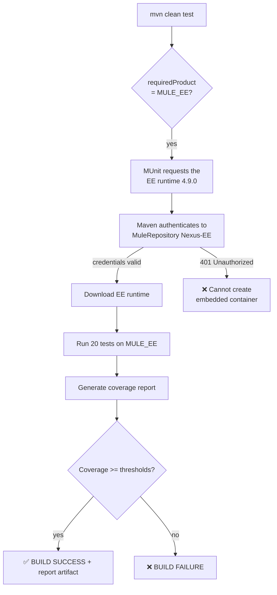

        

<details>
<summary>📦 Repository assets used in this post</summary>

| Asset | Path |
| --- | --- |
| GitHub Actions workflow | [../.github/workflows/munit.yaml](../.github/workflows/munit.yaml) |
| Maven settings for CI | [../.github/settings.xml](../.github/settings.xml) |
| Project POM (coverage config) | [../pom.xml](../pom.xml) |
| Mule artifact descriptor | [../mule-artifact.json](../mule-artifact.json) |
| MUnit test suite | [../src/test/munit/munit-orders-api-suite.xml](../src/test/munit/munit-orders-api-suite.xml) |

</details>

# Enforcing MUnit Coverage in CI on the Mule Enterprise Runtime

In [Part 1](#) we built a GitHub Actions pipeline that runs our MUnit suite on every push — on the **Community** runtime. It works, it is free, and it gives us a fast safety net. But it leaves a gap: we have no idea **how much** of the application our tests actually exercise. Coverage is the number that turns "the tests pass" into "the tests pass *and* they cover 100% of the flows".

There is a catch, and it is the reason this is a separate post: **MUnit code coverage is an Enterprise-only feature.** It only runs when the suite executes on the **Enterprise (`MULE_EE`)** Mule runtime. And the EE runtime is not a free download — it lives in MuleSoft's private enterprise repository and requires real credentials.

In this post we promote the Part 1 pipeline to the Enterprise runtime: we force the EE product, configure the enterprise repository with secured GitHub secrets, enable coverage thresholds in the POM, and make the build **fail** when coverage falls short. We also clean up two production-grade details: keeping the actions current and authenticating only where we should.

> 🔗 **Previous:** [Part 1 — Running MUnit Tests in CI with GitHub Actions](#) · **Series:** [MUnit in CI with GitHub Actions](#)

## Prerequisites

- A working MUnit pipeline from [Part 1](#) (workflow + `settings.xml` + Anypoint secrets).
- **MuleSoft enterprise repository credentials** — a Nexus username/password issued by MuleSoft Support, tied to an enterprise license. These are **not** the same as the Anypoint connected-app Client ID/Secret.
- Maintainer access to the GitHub repository (to add secrets).

> [!WARNING]
> The Anypoint connected-app credentials from Part 1 **cannot** download the Enterprise runtime. The enterprise runtime artifacts (`com.mulesoft.mule.distributions`) live behind a separate Nexus account. Without those credentials, this pipeline cannot work — there is no free path to the EE runtime.

## Overview

The flow is the same as Part 1, with one decisive difference: MUnit must select the **Enterprise** runtime, and the runner must be able to **download** it. Once both are true, coverage runs automatically and the POM thresholds gate the build.



## Table of Contents

1. [Step 1 — Force the Enterprise runtime](#step-1--force-the-enterprise-runtime)
2. [Step 2 — Add the enterprise repository to settings.xml](#step-2--add-the-enterprise-repository-to-settingsxml)
3. [Step 3 — Store the enterprise credentials as GitHub secrets](#step-3--store-the-enterprise-credentials-as-github-secrets)
4. [Step 4 — Pass the secrets to the workflow](#step-4--pass-the-secrets-to-the-workflow)
5. [Step 5 — Enable coverage thresholds in the POM](#step-5--enable-coverage-thresholds-in-the-pom)
6. [Step 6 — Publish the coverage report](#step-6--publish-the-coverage-report)
7. [Step 7 — Keep the pipeline clean: current actions and anonymous public repos](#step-7--keep-the-pipeline-clean-current-actions-and-anonymous-public-repos)
8. [Step 8 — Push and verify](#step-8--push-and-verify)

### Step 1 — Force the Enterprise runtime

Coverage only runs on `MULE_EE`. In Part 1 we deliberately ran on `MULE_CE`, so we now have to make the application require the Enterprise runtime. The cleanest, declarative way is the `requiredProduct` field in `mule-artifact.json`.

```diff title="mule-artifact.json"
 {
   "minMuleVersion": "4.9.0",
+  "requiredProduct": "MULE_EE",
   "javaSpecificationVersions": [
     "17"
   ]
 }
```

📄 Full file: [mule-artifact.json](../mule-artifact.json)

> [!TIP]
> `requiredProduct` forces the runtime regardless of which components the app uses, so we keep the clean Community-compatible app from Part 1. (Re-introducing an EE component such as `<ee:transform>` also selects `MULE_EE`, but the descriptor field is explicit and reversible.)

### Step 2 — Add the enterprise repository to settings.xml

The EE runtime distribution is served from the MuleSoft enterprise Nexus. We add both the **repository** and a **matching server** (credentials) to the CI settings file. The `id` of the server must match the `id` of the repository — that is how Maven pairs credentials with a repository.

```xml title=".github/settings.xml — additions"
<!-- inside <servers> -->
<server>
    <id>MuleRepository</id>
    <username>${env.MULE_EE_USERNAME}</username>
    <password>${env.MULE_EE_PASSWORD}</password>
</server>

<!-- inside the active <profile> / <repositories> -->
<repository>
    <id>MuleRepository</id>
    <name>MuleRepository</name>
    <url>https://repository.mulesoft.org/nexus-ee/content/repositories/releases-ee/</url>
    <layout>default</layout>
    <releases><enabled>true</enabled></releases>
    <snapshots><enabled>true</enabled></snapshots>
</repository>
```

📄 Full file: [.github/settings.xml](../.github/settings.xml)

### Step 3 — Store the enterprise credentials as GitHub secrets

The settings file reads `${env.MULE_EE_USERNAME}` / `${env.MULE_EE_PASSWORD}`. Add them as repository secrets — keep them out of the YAML and out of your shell history.

```bash
gh secret set MULE_EE_USERNAME -R <owner>/<repo> --body 'YOUR_NEXUS_USERNAME'
gh secret set MULE_EE_PASSWORD -R <owner>/<repo> --body 'YOUR_NEXUS_PASSWORD'
```

Confirm they registered:

```bash
gh secret list -R <owner>/<repo>
```

> [!NOTE]
> Screenshot to include: the repository **Actions secrets** page showing `ANYPOINT_CLIENT_ID`, `ANYPOINT_CLIENT_SECRET`, `MULE_EE_USERNAME`, and `MULE_EE_PASSWORD`.

### Step 4 — Pass the secrets to the workflow

Map the new secrets into the environment of the Maven step so `${env.*}` resolves in `settings.xml`.

```diff title=".github/workflows/munit.yaml"
         env:
           ANYPOINT_CLIENT_ID: ${{ secrets.ANYPOINT_CLIENT_ID }}
           ANYPOINT_CLIENT_SECRET: ${{ secrets.ANYPOINT_CLIENT_SECRET }}
+          MULE_EE_USERNAME: ${{ secrets.MULE_EE_USERNAME }}
+          MULE_EE_PASSWORD: ${{ secrets.MULE_EE_PASSWORD }}
```

📄 Full file: [.github/workflows/munit.yaml](../.github/workflows/munit.yaml)

### Step 5 — Enable coverage thresholds in the POM

Coverage is configured on the MUnit Maven Plugin. We ask for HTML/console/JSON reports, set per-dimension thresholds, and — crucially — `failBuild` so the pipeline goes red when coverage is insufficient.

```xml title="pom.xml — munit-maven-plugin configuration"
<plugin>
    <groupId>com.mulesoft.munit.tools</groupId>
    <artifactId>munit-maven-plugin</artifactId>
    <version>${munit.version}</version>
    <executions>
        <execution>
            <id>test</id>
            <phase>test</phase>
            <goals>
                <goal>test</goal>
                <goal>coverage-report</goal>
            </goals>
        </execution>
    </executions>
    <configuration>
        <coverage>
            <formats>
                <format>html</format>
                <format>console</format>
                <format>json</format>
            </formats>
            <runCoverage>true</runCoverage>
            <requiredApplicationCoverage>80</requiredApplicationCoverage>
            <requiredResourceCoverage>75</requiredResourceCoverage>
            <requiredFlowCoverage>70</requiredFlowCoverage>
            <failBuild>true</failBuild>
        </coverage>
    </configuration>
</plugin>
```

📄 Full file: [pom.xml](../pom.xml)

> [!IMPORTANT]
> On the Community runtime this whole block is silently ignored — the log prints `Coverage is a EE only feature and you've selected to run over CE`. The thresholds only take effect once Step 1 puts us on `MULE_EE`.

### Step 6 — Publish the coverage report

A coverage number we cannot see is not very useful. We add two `if: always()` steps: one writes the headline numbers to the run summary page, the other uploads the full HTML report as a downloadable artifact.

```yaml title=".github/workflows/munit.yaml — reporting steps"
- name: Publish coverage to the run summary
  if: always()
  run: |
    {
      echo "### 🧪 MUnit Coverage"
      echo ""
      echo "Build status: **${{ job.status }}**"
      echo ""
      echo '```'
      grep -iE 'coverage|tests run|MUnit Run Summary' mvn.log || echo "no coverage lines captured"
      echo '```'
    } >> "$GITHUB_STEP_SUMMARY"

- name: Publish coverage report artifact
  if: always()
  uses: actions/upload-artifact@v7
  with:
    name: munit-coverage-report
    path: |
      target/META-INF/mule-src/*/reports/
      target/site/munit/coverage/
    if-no-files-found: warn
```

📄 Full file: [.github/workflows/munit.yaml](../.github/workflows/munit.yaml)

### Step 7 — Keep the pipeline clean: current actions and anonymous public repos

Two production-grade cleanups that save us from confusing failures later.

**Use current action versions.** Older `@v4` actions run on a deprecated Node version and emit warnings. Bump to the latest majors:

```diff title=".github/workflows/munit.yaml"
-        uses: actions/checkout@v4
+        uses: actions/checkout@v7
-        uses: actions/setup-java@v4
+        uses: actions/setup-java@v5
-        uses: actions/upload-artifact@v4
+        uses: actions/upload-artifact@v7
```

**Authenticate only where required.** This one bites on a cold cache. The public `mulesoft-releases` repository serves the MUnit artifacts anonymously, but if we attach credentials to its `<server>` entry, Maven presents them and the repository can answer `401 Unauthorized` instead of serving the file. As long as those artifacts are already in the Maven cache, the download is skipped and we never notice — until a cache key change (for example, bumping `setup-java`) forces a fresh download and the build suddenly fails. The fix is to **remove** the public repo's `<server>` block so it is accessed anonymously; keep credentials only on `anypoint-exchange-v3` and `MuleRepository`.

```diff title=".github/settings.xml"
-        <server>
-            <id>mulesoft-releases</id>
-            <username>~~~Client~~~</username>
-            <password>${env.ANYPOINT_CLIENT_ID}~?~${env.ANYPOINT_CLIENT_SECRET}</password>
-        </server>
```

> [!TIP]
> Verify an artifact is anonymously available before trusting it in CI:
> ```bash
> curl -s -o /dev/null -w "%{http_code}\n" \
>   https://repository.mulesoft.org/releases/com/mulesoft/munit/munit-runner/3.7.0/munit-runner-3.7.0.pom
> ```
> A `200` means no credentials are needed for that repository.

### Step 8 — Push and verify

Commit everything and push. On the runner you can also test the credentials path independently with `curl` before pushing, to separate "bad credentials" from "bad configuration".

```bash
git add .github/ pom.xml mule-artifact.json
git commit -m "Run MUnit on the Enterprise runtime and enforce coverage"
git push origin main

gh run watch "$(gh run list --limit 1 --json databaseId -q '.[0].databaseId')" --exit-status
```

> [!NOTE]
> Screenshot to include: the GitHub **Actions** run summary page showing the "🧪 MUnit Coverage" section and the `munit-coverage-report` artifact available for download.

## Verification

A successful Enterprise run prints the coverage table and the application total, then `BUILD SUCCESS`:

```text
[INFO] MUnit Run Summary - Product: MULE_EE, Version: 4.9.0
[INFO]  >> munit-orders-api-suite.xml test result: Tests: 20, Errors: 0, Failures: 0, Skipped: 0
[INFO] +----------------------------+----------+-------------+-----------+----------+
[INFO] | Name                       | Type     | Covered (P) | Total (P) | Coverage |
[INFO] +----------------------------+----------+-------------+-----------+----------+
[INFO] | orders-api-main            | Flow     |      6      |     6     | 100.00%  |
[INFO] | validate-order-subflow     | Sub flow |      2      |     2     | 100.00%  |
[INFO] | notify-flow                | Flow     |      1      |     1     | 100.00%  |
[INFO] | build-order-record-subflow | Sub flow |      1      |     1     | 100.00%  |
[INFO] | route-order-flow           | Flow     |      6      |     6     | 100.00%  |
[INFO] +----------------------------+----------+-------------+-----------+----------+
[INFO]                 ** Application Coverage: 100.00% **
[INFO] BUILD SUCCESS
```

We confirm:

- **`Product: MULE_EE`** — we are on the Enterprise runtime, so coverage is active.
- **`Application Coverage`** is printed and is at or above our thresholds.
- The **`munit-coverage-report`** artifact is attached to the run, and the coverage block appears on the run summary page.

## Troubleshooting

| Symptom | Likely Cause | Fix |
| --- | --- | --- |
| `401 Unauthorized` from `MuleRepository` (`nexus-ee`) | Enterprise credentials missing, wrong, or not entitled to `releases-ee` | Verify the `MULE_EE_USERNAME`/`MULE_EE_PASSWORD` secrets; test with `curl -u user:pass <artifact-url>` (expect `200`) |
| `401 Unauthorized` from public `repository.mulesoft.org/releases/` | Credentials attached to a public repo's `<server>`; exposed on a cold cache | Remove the public repo's `<server>` block so it is accessed anonymously |
| `Coverage Report will not be printed. No coverage data found` + `Product: MULE_CE` | Running on the Community runtime, where coverage is disabled | Set `"requiredProduct": "MULE_EE"` in `mule-artifact.json` |
| `Cannot create embedded container` after adding the EE repo | EE runtime resolved but credentials rejected (`401`) | Same as the `MuleRepository` row — fix the enterprise credentials |
| Build fails on `requiredApplicationCoverage` not met | Real coverage gap; thresholds enforced via `failBuild` | Add MUnit tests for the uncovered processors, or adjust thresholds intentionally |
| Build green locally but `401` only in CI | Local `~/.m2` already cached the runtime; the runner starts clean | Ensure CI credentials are valid; do not rely on a warm cache |

> [!NOTE]
> Running MUnit on the EE runtime may, in some environments, also require an Enterprise **license** to be available. If a run gets past authentication but fails on a licensing error, provide the license as an additional secret and install it before the test step.

## Summary

Our pipeline now runs the full MUnit suite on the **Enterprise** Mule runtime and enforces code coverage on every push: the EE runtime is pulled from the private enterprise repository using secured GitHub secrets, the POM thresholds gate the build, and each run publishes both a summary and a downloadable HTML report. Combined with [Part 1](#), we have gone from "tests run on my laptop" to "tests *and* coverage are enforced automatically, on a clean machine, for every change".

From here, natural next steps are protecting the `main` branch with the workflow as a required status check, and extending the suite until the coverage thresholds reflect a number the team is proud to defend.

## References

- [MUnit coverage](https://docs.mulesoft.com/munit/latest/munit-coverage)
- [MUnit Maven Plugin](https://docs.mulesoft.com/munit/latest/munit-maven-plugin)
- [Configuring Maven for the MuleSoft Enterprise repository](https://docs.mulesoft.com/mule-runtime/latest/maven-reference)
- [mule-artifact.json descriptor reference](https://docs.mulesoft.com/mule-runtime/latest/application-descriptor)
- [Encrypted secrets in GitHub Actions](https://docs.github.com/en/actions/security-guides/encrypted-secrets)
- [actions/upload-artifact](https://github.com/actions/upload-artifact)
