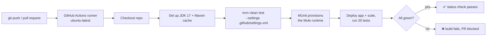

        

<details>
<summary>📦 Repository assets used in this post</summary>

| Asset | Path |
| --- | --- |
| GitHub Actions workflow | [../.github/workflows/munit.yaml](../.github/workflows/munit.yaml) |
| Maven settings for CI | [../.github/settings.xml](../.github/settings.xml) |
| Project POM | [../pom.xml](../pom.xml) |
| Mule application | [../src/main/mule/munit-orders-api.xml](../src/main/mule/munit-orders-api.xml) |
| MUnit test suite | [../src/test/munit/munit-orders-api-suite.xml](../src/test/munit/munit-orders-api-suite.xml) |

</details>

# Running MUnit Tests in CI with GitHub Actions

Tests that only run on the developer's laptop are tests we cannot trust. If we want our MUnit suite to actually protect the API, it has to run automatically — on every push and every pull request, on a clean machine, with no "but it works on my Studio" caveats. GitHub Actions gives us exactly that: a fresh Ubuntu runner that checks out our code, builds the Mule application, and executes MUnit from scratch.

In this post we wire up a complete GitHub Actions workflow for a Mule 4.9 application (`munit-orders-api`) so that `mvn clean test` runs the full MUnit suite in CI. Along the way we hit the single most common reason MUnit pipelines fail on a clean runner — the Mule runtime cannot be downloaded — and we explain exactly why it happens and how to get past it.

By the end we will have a green pipeline running 20 MUnit tests on every commit, with zero manual steps.

> 🔗 **Series:** [MUnit in CI with GitHub Actions](#) · **Part:** 1 of 2

## Prerequisites

- A Mule 4.x application with an MUnit test suite that passes locally in Anypoint Studio.
- The project builds with the **Mule Maven Plugin** and **MUnit Maven Plugin** (this example uses MUnit `3.7.0` on Mule `4.9`).
- A GitHub repository for the project.
- An **Anypoint Platform connected app** (Client ID + Client Secret) with access to Exchange, used by Maven to resolve dependencies.
- JDK 17 and Maven available locally to reproduce the build.

> [!NOTE]
> This post runs MUnit on the **Community Edition (CE)** Mule runtime, which is freely downloadable and needs no enterprise license. Code coverage is an Enterprise-only feature — we add it in [Part 2](#).

## Overview

The pipeline is intentionally small. A single job on `ubuntu-latest` checks out the repo, installs JDK 17, and runs Maven. The interesting part is what happens inside `mvn clean test`: the MUnit Maven Plugin provisions a Mule runtime, deploys the app and the test suite into it, and runs the tests.



## Table of Contents

1. [Step 1 — Create the workflow file](#step-1--create-the-workflow-file)
2. [Step 2 — Add a Maven settings.xml for CI](#step-2--add-a-maven-settingsxml-for-ci)
3. [Step 3 — Store the Anypoint credentials as GitHub secrets](#step-3--store-the-anypoint-credentials-as-github-secrets)
4. [Step 4 — Make the app run on the Community runtime](#step-4--make-the-app-run-on-the-community-runtime)
5. [Step 5 — Push and watch the run](#step-5--push-and-watch-the-run)

### Step 1 — Create the workflow file

GitHub Actions reads workflow definitions from `.github/workflows/`. We create a single workflow that triggers on pushes to `main`, on pull requests targeting `main`, and on demand from the Actions tab.

```yaml title=".github/workflows/munit.yaml"
name: MUnit CI

on:
  push:
    branches: [ main ]
  pull_request:
    branches: [ main ]
  workflow_dispatch:        # manual "Run workflow" button in the Actions tab

jobs:
  test:
    name: Run MUnit
    runs-on: ubuntu-latest

    steps:
      - name: Checkout
        uses: actions/checkout@v7

      - name: Set up JDK 17
        uses: actions/setup-java@v5
        with:
          distribution: temurin
          java-version: '17'
          cache: maven

      - name: Run MUnit tests
        env:
          ANYPOINT_CLIENT_ID: ${{ secrets.ANYPOINT_CLIENT_ID }}
          ANYPOINT_CLIENT_SECRET: ${{ secrets.ANYPOINT_CLIENT_SECRET }}
        run: |
          set -o pipefail
          mvn clean test \
            --settings .github/settings.xml \
            --batch-mode \
            --no-transfer-progress | tee mvn.log
```

📄 Full file: [.github/workflows/munit.yaml](../.github/workflows/munit.yaml)

A few decisions worth calling out:

- **`cache: maven`** caches `~/.m2` keyed off our POM, so subsequent runs skip re-downloading dependencies.
- **`--settings .github/settings.xml`** points Maven at a project-local settings file (next step) instead of the runner's default — so credentials and repositories are explicit and reproducible.
- **`set -o pipefail` + `tee mvn.log`** keeps the build's exit code intact while saving the full log for later steps.

> [!NOTE]
> Screenshot to include: the new `munit.yaml` file shown in the GitHub repository file tree under `.github/workflows/`.

### Step 2 — Add a Maven settings.xml for CI

On a clean runner, Maven needs to know **which repositories** to use and **how to authenticate**. We commit a settings file under `.github/` so it travels with the repo.

```xml title=".github/settings.xml"
<settings xmlns="http://maven.apache.org/SETTINGS/1.0.0">
    <servers>
        <server>
            <id>anypoint-exchange-v3</id>
            <username>~~~Client~~~</username>
            <password>${env.ANYPOINT_CLIENT_ID}~?~${env.ANYPOINT_CLIENT_SECRET}</password>
        </server>
    </servers>

    <profiles>
        <profile>
            <id>Mule</id>
            <activation>
                <activeByDefault>true</activeByDefault>
            </activation>
            <repositories>
                <repository>
                    <id>anypoint-exchange-v3</id>
                    <name>Anypoint Exchange</name>
                    <url>https://maven.anypoint.mulesoft.com/api/v3/maven</url>
                    <layout>default</layout>
                </repository>
                <repository>
                    <id>mulesoft-releases</id>
                    <name>MuleSoft Releases</name>
                    <url>https://repository.mulesoft.org/releases/</url>
                    <layout>default</layout>
                </repository>
            </repositories>
        </profile>
    </profiles>
</settings>
```

📄 Full file: [.github/settings.xml](../.github/settings.xml)

> [!IMPORTANT]
> Attach credentials **only** to the repository that needs them. The `~~~Client~~~` username with the `CLIENT_ID~?~CLIENT_SECRET` password is the connected-app convention for **Anypoint Exchange**. The public `mulesoft-releases` repository serves the MUnit artifacts anonymously — do **not** add a `<server>` entry for it. Presenting credentials to a public repository can make it answer `401 Unauthorized` instead of serving the file. (We cover this failure mode in detail in Part 2.)

### Step 3 — Store the Anypoint credentials as GitHub secrets

The settings file reads `${env.ANYPOINT_CLIENT_ID}` and `${env.ANYPOINT_CLIENT_SECRET}`, which our workflow maps from GitHub secrets. Add them to the repository:

```bash
gh secret set ANYPOINT_CLIENT_ID     -R <owner>/<repo> --body 'YOUR_CONNECTED_APP_CLIENT_ID'
gh secret set ANYPOINT_CLIENT_SECRET -R <owner>/<repo> --body 'YOUR_CONNECTED_APP_CLIENT_SECRET'
```

Or via the UI: **Settings → Secrets and variables → Actions → New repository secret**, named exactly `ANYPOINT_CLIENT_ID` and `ANYPOINT_CLIENT_SECRET`.

> [!NOTE]
> Screenshot to include: the repository **Actions secrets** page showing both `ANYPOINT_*` secrets present.

### Step 4 — Make the app run on the Community runtime

This is the step that trips up almost everyone. Run the workflow as-is against an app that uses Enterprise components and the build dies with:

```text
[ERROR] An error occurred: java.lang.IllegalStateException: Cannot create embedded container
Caused by: ...Could not find artifact
  com.mulesoft.mule.distributions:mule-runtime-impl-no-services-bom:pom:4.9.0 in maven-central
```

Here is **why**: MUnit provisions a Mule runtime to run the tests, and it picks **Enterprise (`MULE_EE`)** whenever the application uses any EE-only component — the classic one being the **Transform Message** (`<ee:transform>`). The EE runtime distribution lives in MuleSoft's private enterprise repository; it is not on Maven Central or the public repos. It works on our laptop only because Anypoint Studio already cached it. On a clean runner there is nothing to download, so the container cannot be built.

For a pipeline that just runs tests, the simplest fix is to run on the **Community (`MULE_CE`)** runtime, which is publicly downloadable. To do that, the application must avoid EE-only components. The good news: a payload-only `<ee:transform>` is equivalent to the core `<set-payload>` with the same DataWeave.

```diff title="src/main/mule/munit-orders-api.xml"
-        <ee:transform>  <!-- 201 body -->
-            <ee:message>
-                <ee:set-payload><![CDATA[%dw 2.0
-output application/json
----
-payload]]></ee:set-payload>
-            </ee:message>
-        </ee:transform>
+        <set-payload value='#[%dw 2.0&#10;output application/json&#10;---&#10;payload]' doc:name="201 body"/>
```

📄 Full file: [src/main/mule/munit-orders-api.xml](../src/main/mule/munit-orders-api.xml)

Two smaller adjustments complete the move to CE:

1. **Align the suite's `minMuleVersion`.** MUnit provisions runtime `4.9.0`; if the suite declares a higher minimum it is silently skipped (`no suites will run`, 0 tests).

   ```diff title="src/test/munit/munit-orders-api-suite.xml"
   -    <munit:config name="munit-orders-api-suite" minMuleVersion="4.9.11" .../>
   +    <munit:config name="munit-orders-api-suite" minMuleVersion="4.9.0" .../>
   ```

2. **Remove empty `<munit:validation/>` blocks.** Tests that assert errors via `expectedErrorType` need no validation body, but an *empty* element fails MUnit 3.7.0's schema. Delete the empty tags (the optional element can simply be omitted).

   ```diff title="src/test/munit/munit-orders-api-suite.xml"
   -        <!-- THEN: error asserted via expectedErrorType -->
   -        <munit:validation/>
   ```

📄 Full file: [src/test/munit/munit-orders-api-suite.xml](../src/test/munit/munit-orders-api-suite.xml)

> [!TIP]
> Reproduce the exact CI behavior locally before pushing:
> ```bash
> mvn clean test --settings .github/settings.xml --batch-mode --no-transfer-progress
> ```
> Watch the run summary line — `Product: MULE_CE` confirms we are on the Community runtime.

### Step 5 — Push and watch the run

Commit the workflow, settings, and app changes, then push. The workflow triggers automatically.

```bash
git add .github/ pom.xml src/
git commit -m "Add GitHub Actions workflow to run MUnit on the Community runtime"
git push origin main

# Watch the latest run to completion from the terminal
gh run watch "$(gh run list --limit 1 --json databaseId -q '.[0].databaseId')" --exit-status
```

> [!NOTE]
> Screenshot to include: the GitHub **Actions** tab showing the `MUnit CI` run with a green check, and the expanded "Run MUnit tests" step.

## Verification

A successful run prints the MUnit summary near the end of the log:

```text
[INFO] MUnit Run Summary - Product: MULE_CE, Version: 4.9.0
[INFO]  >> munit-orders-api-suite.xml test result: Tests: 20, Errors: 0, Failures: 0, Skipped: 0
[INFO] BUILD SUCCESS
```

We confirm three things:

- **`Product: MULE_CE`** — we are on the publicly downloadable Community runtime.
- **`Tests: 20` with `Errors: 0, Failures: 0`** — the whole suite ran (not silently skipped).
- **`BUILD SUCCESS`** and a green status check on the commit / PR.

## Troubleshooting

| Symptom | Likely Cause | Fix |
| --- | --- | --- |
| `Cannot create embedded container` / `mule-runtime-impl-no-services-bom ... not found` | MUnit selected the **EE** runtime (app uses an EE-only component) and it cannot be downloaded on a clean runner | Run on **CE**: replace EE-only components (e.g. `<ee:transform>`) with core equivalents like `<set-payload>` |
| `no suites will run` / `Tests: 0` | The suite's `minMuleVersion` is higher than the runtime MUnit provisions | Lower `minMuleVersion` in `<munit:config>` to match the provisioned runtime (e.g. `4.9.0`) |
| `The content of element 'munit:validation' is not complete` | An empty `<munit:validation/>` element violates the MUnit schema | Remove the empty element (it is optional for `expectedErrorType` tests) |
| `401 Unauthorized` from a **public** repo (`repository.mulesoft.org/releases/`) | Credentials were attached to a `<server>` for a public repository | Remove the `<server>` entry for the public repo so Maven downloads anonymously |
| Build passes locally but fails in CI | Studio cached the runtime/dependencies; the runner starts clean | Reproduce with the exact `mvn` command above and a clean `~/.m2` |

## Summary

We now have a GitHub Actions pipeline that runs our entire MUnit suite on every push and pull request, on a clean runner, against the Community Mule runtime — 20 tests, fully automated, with the most common "Mule runtime won't download" failure understood and avoided.

The one thing we did **not** get is **code coverage**: MUnit coverage is an Enterprise-only feature and is skipped on the Community runtime. In **Part 2 — Enforcing MUnit Coverage in CI on the Mule Enterprise Runtime**, we switch the pipeline to the Enterprise runtime, wire up the private enterprise repository with secured credentials, and make the build fail when coverage drops below our thresholds.

> ➡️ **Next up:** In Part 2 we move to the Enterprise runtime, configure the MuleSoft enterprise repository, and enforce coverage gates (application / resource / flow) directly in CI.

## References

- [MUnit documentation](https://docs.mulesoft.com/munit/latest/)
- [MUnit Maven Plugin](https://docs.mulesoft.com/munit/latest/munit-maven-plugin)
- [Mule Maven Plugin](https://docs.mulesoft.com/mule-runtime/latest/mmp-concept)
- [GitHub Actions documentation](https://docs.github.com/en/actions)
- [actions/setup-java](https://github.com/actions/setup-java)
- [Configuring Maven for Anypoint Exchange](https://docs.mulesoft.com/exchange/to-publish-assets-maven)
